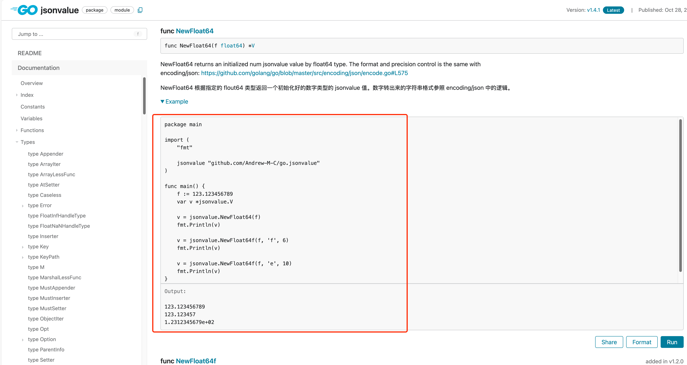

[TOC]

# 概述（Summary）

Go 是一门全新的语言。尽管它从既有的语言中借鉴了许多理念，但其与众不同的特性， 使得使用 Go 编程在本质上就不同于其它语言。要想将 Go 代码写得好，就必须理解其特性和风格。了解命名、格式化、程序结构等既定规则也同样重要，这样你编写的程序才能更容易被其他程序员所理解。

本文档就如何编写清晰、地道的 Go 代码提供了一些技巧。

# 基本原则（Principles）

## 一致（Consistent）

一些规约都是客观性的评估，是根据场景、上下文、或者主观性的判断；但是最重要的是，保持一致。

一致性的代码更容易维护、需要更少的学习成本、并且随着新的约定出现或者出现错误后更容易迁移、更新、修复 bug。

相反，在一个代码库中包含多个完全不同或冲突的代码风格会导致维护成本开销、不确定性和认知偏差。所有这些都会直接导致速度降低、代码审查痛苦、而且增加 bug 数量。

## 简单、清晰、直观（Simple、Clear、Intuitive）

在保持一致性的前提下，简单、清晰、直观是需要做到的第二层。比如：

* type、function 命名词不达意
* 注释内容 表达含糊不清，看完之后反倒不利于理解实现逻辑

简单、清晰、直观的代码更容易理解，更有利于协作。

# 规约（Guidelines）

## 格式（Format）

### 使用工具（Use tools to format）

格式化问题总是充满了争议，但却始终没有形成统一的定论。虽说人可以适应不同的编码风格， 但如果不用适应岂不更好。如果所有人都遵循相同的编码风格，在这类问题上浪费的时间将会更少。 关键就在于如何实现这种设想，而无需冗长的语言风格规范。Go语言开发团队 另辟蹊径，让程序来处理大部分的格式化问题。

使用 [gofmt](https://pkg.go.dev/cmd/gofmt) 或者 [goimports](https://pkg.go.dev/golang.org/x/tools%40v0.1.7/cmd/goimports) 格式化你的代码。goimports 是 gofmt 的超集，会自动 增加必要的 import 或者 删除无需的 import。

**例子**

*Bad：*

```go
// 格式化前
type T struct {
    name string // name of the object
    value int // its value
}
```

*Good：*

```go
// 格式化后
type T struct {
    name    string // name of the object
    value   int    // its value
}
```


还有一些关于格式化的细节，它们非常简短：

**1、缩进**

我们使用制表符（tab）缩进，gofmt 默认也使用它。在你认为确实有必要时再使用空格。

**2、行的长度**

Go 对行的长度没有限制，别担心打孔纸不够长。如果一行实在太长，也可进行折行并插入适当的 tab 缩进。

**3、括号**

比起 C 和 Java，Go 所需的括号更少：控制结构（`if`、`for` 和 `switch`）在语法上并不需要圆括号。此外，操作符优先级处理变得更加简洁，因此

```go
x<<8 + y<<16
```

正表述了空格符所传达的含义。

### 相似的声明放在一组（Group similar declarations）

Go 语言支持将相似的声明放在一个组内。

**例子**

*Bad：*

```go
import "a"
import "b"
```

*Good：*

```go
import (
  "a"
  "b"
)
```

这同样适用于常量、变量和类型声明：

**例子**

*Bad：*

```go
const a = 1
const b = 2

var a = 1
var b = 2

type Area float64
type Volume float64
```

*Good：*

```go
const (
  a = 1
  b = 2
)

var (
  a = 1
  b = 2
)

type (
  Area float64
  Volume float64
)
```

仅将相关的声明放在一组，不要将不相关的声明放在一组。

**例子1**

*Bad：*

```go
var countLock   sync.Mutex

var inputCount  uint32
var outputCount uint32
var errorCount  uint32
```

*Good：*

```go
var (
    countLock   sync.Mutex
    inputCount  uint32
    outputCount uint32
    errorCount  uint32
)
```

**例子2**

*Bad：*

```go
type Operation int

const (
  Add Operation = iota + 1
  Subtract
  Multiply
  EnvVar = "MY_ENV"
)
```

*Good：*

```go
type Operation int

const (
  Add Operation = iota + 1
  Subtract
  Multiply
)

const EnvVar = "MY_ENV"
```

分组使用的位置没有限制，例如：你可以在函数内部使用它们：

**例子**

*Bad：*

```go
func f() string {
  var red = color.New(0xff0000)
  var green = color.New(0x00ff00)
  var blue = color.New(0x0000ff)

  ...
}
```

*Good：*

```go
func f() string {
  var (
    red   = color.New(0xff0000)
    green = color.New(0x00ff00)
    blue  = color.New(0x0000ff)
  )

  ...
}
```

### import分组和顺序（Import group ordering）

`import`应该分为两组：

* 标准库
* 其他库

这也是 goimports 默认的分组。

**例子**

*Bad：*

```go
import (
  "fmt"
  "os"
  "go.uber.org/atomic"
  "golang.org/x/sync/errgroup"
  "gitlab.company.com/my/package"
)
```

*Good：*

```go
import (
  "fmt"
  "os"

  "go.uber.org/atomic"
  "golang.org/x/sync/errgroup"

  "gitlab.company.com/my/package"
)
)
```


### 函数分组与顺序（Function grouping and ordering）

规则如下：

* 函数应按大致的调用顺序排序
* 同一文件中的函数应按接收者分组

因此，对外暴露的函数应先出现在文件中，放在`struct`, `const`, `var`定义的后面。

在定义类型之后，在接收者的其余方法之前，可能会出现一个`newXYZ()`或`NewXYZ()`

由于函数是按接收者分组的，因此普通工具函数应在文件末尾出现。

**例子**

*Bad：*

```go
func (s *something) Cost() {
  return calcCost(s.weights)
}

type something struct{ ... }

func calcCost(n []int) int {...}

func (s *something) Stop() {...}

func newSomething() *something {
    return &something{}
}
```

*Good：*

```go
type something struct{ ... }        // 结构体定义

func newSomething() *something {    // 结构体构造函数
    return &something{}
}

func (s *something) Cost() {        // 结构体方法
  return calcCost(s.weights)
}

func (s *something) Stop() {...}    // 结构体方法

func calcCost(n []int) int {...}    // 普通工具函数
```


## 注释（Commentary）

Go 语言支持 C 风格的块注释 `/* */` 和 C++ 风格的行注释 `//`。 行注释更为常用，而块注释则主要用作包的注释，当然也可在禁用一大段代码时使用。

### godoc

[godoc](https://pkg.go.dev/golang.org/x/tools/cmd/godoc) 既是一个程序，又是一个 Web 服务器，它对 Go 的源码进行处理，并提取包中的文档内容。 在顶级声明之前，且与该声明之间没有空行的注释，将与该声明一起被提取出来，作为该条目的说明文档。 

### 注释的位置（Positions of commentary）

每个包都应包含一段包注释，即放置在 package 前的一个块注释。

对于包含多个文件的包，允许包注释出现在其中的任一文件中。如果包中的源代码文件比较多而无法挑选代表包的主要源文件，可以在包目录下创建一个 doc.go 文件，专门用于保存包注释内容。比如：fmt 包的注释 [doc.go - Go](https://cs.opensource.google/go/go/+/master:src/fmt/doc.go)


函数注释应放置在 func 前，且和 func 的声明之间不要有空行。

```go
// Scanln is similar to Scan, but stops scanning at a newline and
// after the final item there must be a newline or EOF.
func Scanln(a ...interface{}) (n int, err error) {
		return Fscanln(os.Stdin, a...)
}
```

源代码地址：[scan.go - Go](https://cs.opensource.google/go/go/+/master:src/fmt/scan.go;l=67)

### 注释的格式（Formats of commentary）

注释无需进行额外的格式化，如用星号来突出等。生成的输出甚至可能无法以等宽字体显示， 因此不要依赖于空格对齐，godoc 会像 gofmt 那样处理好这一切。 注释是不会被解析的纯文本，因此像 HTML 或其它类似于 \_这样\_ 的内容将按照 原样 输出，因此不应使用它们。

godoc 会将已缩进的文本以等宽字体显示，来适应对应的程序片段。 fmt 包的注释就用了这种不错的效果。 比如下面的例子：

| go注释 | godoc生成的文档 |
| --- | --- |
| [doc.go - Go](https://cs.opensource.google/go/go/+/master:src/fmt/doc.go) |   [fmt package - fmt - Go Packages](https://pkg.go.dev/fmt) |

godoc 是否会重新格式化注释取决于上下文，因此请确保它们看起来清晰易读： 使用正确的拼写、标点和语句结构以及折叠长行等。

### 注释的内容（Content of commentary）

整体上需要注意以下几点：

* 每个可导出（首字母大写）的名称都应该有文档注释
* 注释应该以被声明的对象的名字开头
* 注释的内容应该 完整、简洁、准确 的描述清楚被声明对象的 作用、逻辑

包注释应在整体上对该包进行介绍，并提供包的相关信息。 它将出现在 godoc 页面中的最上面，并为紧随其后的内容建立详细的文档。

```go
/*
regexp 包为正则表达式实现了一个简单的库。

该库接受的正则表达式语法为：

    regexp:
        concatenation { '|' concatenation }
    concatenation:
        { closure }
    closure:
        term [ '*' | '+' | '?' ]
    term:
        '^'
        '$'
        '.'
        character
        '[' [ '^' ] character-ranges ']'
        '(' regexp ')'
*/
package regexp
```

若某个包比较简单，包注释同样可以简洁些。

```go
// path 包实现了一些常用的工具，
// 以便于操作用反斜杠分隔的路径.
```

在package中，任何顶级声明前面的注释都将作为该声明的文档注释。**在程序中，每个可导出（首字母大写）的名称都应该有文档注释。**

文档注释最好是完整的句子，这样它才能适应各种自动化的展示。 第一句应当以被声明的对象的名字开头，并且是单句的摘要。

```go
// Compile parses a regular expression and returns, if successful,
// a Regexp that can be used to match against text.
func Compile(str string) (*Regexp, error) {
```

**注释应该以被声明的对象的名字开头**，godoc 命令的输出就能通过 grep 变得更加有用。假如你记不住 Compile 这个名称，而又在找正则表达式的解析函数（『解析』意味着关键词为 parse）， 那就可以运行

```sh
$ go doc -all regexp | grep -i parse
```

若包中的所有文档注释都以 This function... 开头，grep 就无法帮你查找。 但是如果每个包的文档注释都以其名称开头，你就能看到这样的内容，使你想起正在寻找的词。

```sh
$ go doc -all regexp | grep -i parse
	Compile parses a regular expression and returns, if successful, a Regexp
	MustCompile is like Compile but panics if the expression cannot be parsed.
	parsed. It simplifies safe initialization of global variables holding
```


### 如何在godoc 生成的页面中添加示例（How to add examples in godoc web page）

了解编写godoc示例的方法，请阅读：

* <https://go.dev/blog/examples>
* [如何写高大上的 godoc](https://segmentfault.com/a/1190000020944376)

| 示例源代码 | godoc页面的 代码示例 |
| --- | --- |
|   [访问页面](https://cs.opensource.google/go/go/%2B/refs/tags/go1.17.2%3Asrc/strings/example_test.go;l=18) |   [访问页面](https://pkg.go.dev/strings#Fields) |
|   [访问页面](https://github.com/Andrew-M-C/go.jsonvalue/blob/master/example_jsonvalue_test.go) |  [访问页面](https://pkg.go.dev/github.com/Andrew-M-C/go.jsonvalue#pkg-examples) |

## 命名（Names）

命名在编码中的重要性非常高。有时候命名会影响语义。

### 混合大小写（MixedCaps）

Go中的约定是使用 MixedCaps 或 mixedCaps 而不是下划线来编写多个单词组成的命名。

### 避免使用内置名称（Avoid using built-in names）

Go语言规范 [language specification](https://golang.org/ref/spec) 概述了几个内置的、不应在Go项目中使用的名称标识 [predeclared identifiers](https://golang.org/ref/spec#Predeclared_identifiers)，如下：

```
Types:
bool byte complex64 complex128 error float32 float64
int int8 int16 int32 int64 rune string
uint uint8 uint16 uint32 uint64 uintptr

Constants:
true false iota

Zero value:
nil

Functions:
append cap close complex copy delete imag len
make new panic print println real recover
```

根据上下文的不同，重复使用这些内置标识符名称，将在当前作用域（或任何嵌套作用域）中隐藏原始标识符，或者混淆代码。在最好的情况下，编译器会报错；在最坏的情况下，这样的代码可能会引入潜在的、难以恢复的错误。

**例子1**

*Bad：*

```go
var error string
// `error` 作用域隐式覆盖

// or

func handleErrorMessage(error string) {
    // `error` 作用域隐式覆盖
}
```

*Good：*

```go
var errorMessage string
// `error` 指向内置的非覆盖

// or

func handleErrorMessage(msg string) {
    // `error` 指向内置的非覆盖
}
```

**例子2**

*Bad：*

```go
type Foo struct {
    // 虽然这些字段在技术上不构成阴影，但`error`或`string`字符串的重映射现在是不明确的。
    error  error
    string string
}

func (f Foo) Error() error {
    // `error` 和 `f.error` 在视觉上是相似的
    return f.error
}

func (f Foo) String() string {
    // `string` and `f.string` 在视觉上是相似的
    return f.string
}
```

*Good：*

```go
type Foo struct {
    // `error` and `string` 现在是明确的。
    err error
    str string
}

func (f Foo) Error() error {
    return f.err
}

func (f Foo) String() string {
    return f.str
}
```

注意，编译器在使用预先分隔的标识符时不会生成错误， 但是如 go vet 之类的工具会正确地指出这些和其他情况下的隐式问题。

### 包名（Package names）

包应当有个恰当的名称：其名称应该简洁、明了、易于理解。包名是导入时所需的唯一默认名称， 它并不需要在所有源码中保持唯一，即便在少数发生冲突的情况下， 也可为导入的包选择一个别名来局部使用。

包的命令需要遵守下面的规则：

-   全部小写。没有大写或下划线。
-   大多数使用命名导入的情况下，不需要重命名。
-   简短而简洁。请记住，在每个使用的地方都完整标识了该名称。
-   不用复数。例如net/url，而不是net/urls。
-   不要用“common”，“util”，“shared” 或 “lib”。这些是不好的，信息量不足的名称。

扩展阅读

* <https://go.dev/blog/package-names>
* <https://rakyll.org/style-packages/>

### 源文件名（Names of source code files）

源文件名应该使用 小写，如果有多个单词，使用下划线连接。

```sh
➜ cd $GOROOT/src/pkg/math/
➜ ls sqrt*s
sqrt_386.s  sqrt_amd64p32.s  sqrt_amd64.s  sqrt_arm.s


mypkg_linux.go         // only builds on linux systems
mypkg_windows_amd64.go // only builds on windows 64bit platforms
```

扩展阅读

-   <https://stackoverflow.com/questions/25161774/what-are-conventions-for-filenames-in-go/25162021>

### 导入别名（Import aliasing）

如果程序包名称与导入路径的最后一个元素不匹配，则必须使用导入别名。

```go
import (
 "net/http"

 client "example.com/client-go"
 trace "example.com/trace/v2"
)
```

在所有其他情况下，除非导入之间有直接冲突，否则应避免导入别名。

**例子**

*Bad：*

```go
import (
  "fmt"
  "os"

  nettrace "golang.net/x/trace"
)
```

*Good：*

```go
import (
  "fmt"
  "os"
  "runtime/trace"

  nettrace "golang.net/x/trace"
)
```

### 函数名（Function name）

使用 [MixedCaps 作为函数名 ](https://golang.org/doc/effective_go.html#mixed-caps) 的约定。

有一个例外，为了对相关的测试用例进行分组，函数名可能包含下划线，如：`TestMyFunction_WhatIsBeingTested`

### 命名Printf样式的函数（Naming printf-style functions）

声明 Printf-style 函数时，请确保 go vet 可以检测到它并检查格式字符串。

这意味着您应尽可能使用预定义的 Printf-style 函数名称。go vet 将默认检查这些。有关更多信息，请参见[Printf 系列](https://golang.org/cmd/vet/#hdr-Printf_family)。

如果不打算使用预定义的名称，函数名称请以 f 结束：Wrapf，而不是Wrap。go vet 可以要求检查特定的 Printf 样式名称，但名称必须以f结尾。

```sh
$ go vet -printfuncs=wrapf,statusf
```

### 接口名（Interface names）

按照约定，只包含一个方法的接口应当以该方法的名称加上 `er` 后缀来命名，如 `Reader`、`Writer`、 `Formatter`、`CloseNotifier` 等。

诸如此类的命名有很多，遵循它们及其代表的函数名会让事情变得简单。 `Read`、`Write`、`Close`、`Flush`、 `String` 等都具有典型的 签名 和 意义。为避免冲突，请不要用这些名称为你的方法命名， 除非你明确知道它们的签名和意义相同。反之，若你的类型实现了的方法与一个著名类型的方法拥有相同的含义，那就使用相同的命名。 请将字符串转换方法命名为 `String` 而非 `ToString`。

### 获取方法（Getters）

Go 并不对获取方法（getter）和设置方法（setter）提供自动支持。 你应当自己提供获取方法和设置方法，通常很值得这样做，但若要将 Get 放到获取方法的名字中，既不符合习惯，也没有必要。若你有个名为 owner （小写，未导出）的字段，其获取方法应当名为 Owner（大写，可导出）而非 GetOwner。大写字母即为可导出的这种规定为区分方法和字段提供了便利。 若要提供设置方法方法，SetOwner 是个不错的选择。两个命名看起来都很合理：

```go
owner := obj.Owner()
if owner != user {
    obj.SetOwner(user)
}
```

## 控制结构（Control structures）

### 减少嵌套（Reduce nesting）

代码应通过尽可能先处理错误情况/特殊情况并尽早返回或继续循环来减少嵌套。减少嵌套多个级别的代码的代码量。

**例子**

*Bad：*

```go
for _, v := range data {
  if v.F1 == 1 {
    v = process(v)
    if err := v.Call(); err == nil {
      v.Send()
    } else {
      return err
    }
  } else {
    log.Printf("Invalid v: %v", v)
  }
}
```

*Good：*

```go
for _, v := range data {
  if v.F1 != 1 {
    log.Printf("Invalid v: %v", v)
    continue
  }

  v = process(v)
  if err := v.Call(); err != nil {
    return err
  }
  v.Send()
}
```

### 不必要的else（Unnecessary else）

如果在 if 的两个分支中都设置了同一个变量，则可以将其替换为单个 if。

**例子**

*Bad：*

```go
var a int
if b {
  a = 100
} else {
  a = 10
}
```

*Good：*

```go
a := 10
if b {
  a = 100
}
```

### Switch语句（Switch statement）

可以将 `if-else-if-else` 链写成一个 `switch`，这也更符合 Go 的风格。

```go
func unhex(c byte) byte {
    switch {
    case '0' <= c && c <= '9':
        return c - '0'
    case 'a' <= c && c <= 'f':
        return c - 'a' + 10
    case 'A' <= c && c <= 'F':
        return c - 'A' + 10
    }
    return 0
}
```

`switch` 并不会自动贯穿（执行当前`case`后不跳出而执行后续的`case`），但 `case` 可通过逗号分隔来列举相同的处理条件。

```go
func shouldEscape(c byte) bool {
    switch c {
    case ' ', '?', '&', '=', '#', '+', '%':
        return true
    }
    return false
}
```

尽管它们在 Go 中的用法和其它类 C 语言差不多，但 break 语句可以使 switch 提前终止。不仅是 switch， 有时候也必须打破层层的循环。在 Go 中，我们只需将标签放置到循环外，然后 “蹦” 到那里即可。下面的例子展示了二者的用法。

```go
Loop:
    for n := 0; n < len(src); n += size {
        switch {
        case src[n] < sizeOne:
            if validateOnly {
                break
            }
            size = 1
            update(src[n])

        case src[n] < sizeTwo:
            if n+1 >= len(src) {
                err = errShortInput
                break Loop
            }
            if validateOnly {
                break
            }
            size = 2
            update(src[n] + src[n+1]<<shift)
        }
    }
```

当然，continue语句也能接受一个可选的标签，不过它只能在循环中使用。

作为这一节的结束，此程序通过使用两个switch语句对字节数组进行比较：

```go
// Compare returns an integer comparing the two byte slices,
// lexicographically.
// The result will be 0 if a == b, -1 if a < b, and +1 if a > b
func Compare(a, b []byte) int {
    for i := 0; i < len(a) && i < len(b); i++ {
        switch {
        case a[i] > b[i]:
            return 1
        case a[i] < b[i]:
            return -1
        }
    }
    switch {
    case len(a) > len(b):
        return 1
    case len(a) < len(b):
        return -1
    }
    return 0
}
```

#### 类型选择（Type switch）

switch 也可用于判断 interface type 的动态类型。

```go
var t interface{}
t = functionOfSomeType()
switch t := t.(type) {
default:
    fmt.Printf("unexpected type %T\n", t)     // %T prints whatever type t has
case bool:
    fmt.Printf("boolean %t\n", t)             // t has type bool
case int:
    fmt.Printf("integer %d\n", t)             // t has type int
case *bool:
    fmt.Printf("pointer to boolean %t\n", *t) // t has type *bool
case *int:
    fmt.Printf("pointer to integer %d\n", *t) // t has type *int
}
```

### 使用 defer 释放资源（Defer to clean up）

使用 defer 释放资源，诸如文件和锁。

**例子**

*Bad：*

```go
p.Lock()
if p.count < 10 {
  p.Unlock()
  return p.count
}

p.count++
newCount := p.count
p.Unlock()

return newCount

// easy to miss unlocks due to multiple returns
```

*Good：*

```go
p.Lock()
defer p.Unlock()

if p.count < 10 {
  return p.count
}

p.count++
return p.count

// more readable
```

<u>Defer 的开销非常小，只有在您可以证明函数执行时间是纳秒级的程度时，才应避免使用defer。使用 defer 提升可读性是值得的，因为使用它们的成本微不足道（相对的）</u>。尤其适用于那些不仅仅是简单内存访问的大方法，在这些方法中其他计算的资源消耗远超过defer。

扩展阅读

-   Defer的开销
    -   [使用 defer 的运行时开销](https://zhuanlan.zhihu.com/p/152549801)
    -   [使用 defer 还是不使用 defer?](https://colobu.com/2019/01/22/Runtime-overhead-of-using-defer-in-go/)

## 函数（Functions）

### 多返回值（Multiple return values）

Go 与众不同的特性之一就是 函数、方法 可返回多个值。这种形式可以改善 C 中一些笨拙的习惯： 返回错误值（例如用 -1 表示 EOF） 同时 修改通过地址传入的实参。

在 C 中，写入操作发生的错误会用一个负数标记，而错误码会隐藏在某个不确定的位置。 而在 Go 中，Write 会返回写入的字节数以及一个错误： “是的，您写入了一些字节，但并未全部写入，因为设备已满”。 在 os 包中，`File.Write` 的签名为：

```go
func (file *File) Write(b []byte) (n int, err error)
```

它返回写入的字节数，并在 `n != len(b)` 时返回一个非 `nil` 的 `error` 错误值。 这是一种常见的编码风格。

有一种简单的方法，可以避免 通过传入指针来模拟引用参数。 下面简单的函数可从字节数组中的特定位置开始 获取数字，并返回该数字 和 下一个开始扫描的位置。

```go
func nextInt(b []byte, i int) (int, int) {
    for ; i < len(b) && !isDigit(b[i]); i++ {
    }
    x := 0
    for ; i < len(b) && isDigit(b[i]); i++ {
        x = x*10 + int(b[i]) - '0'
    }
    return x, i
}
```

如下所示，通过 nextInt 扫描输入的切片 b 中的数字。

```go
for i := 0; i < len(b); {
    x, i = nextInt(b, i)
    fmt.Println(x)
}
```

### 命名的结果参数（Named result parameters）

Go 函数的返回值或结果 “形参” 可被命名，并作为常规变量使用，就像传入的形参一样。 命名后，一旦该函数开始执行，它们就会被初始化为与其类型相应的零值； 若该函数执行了一条不带实参的 return 语句，则结果形参的当前值将被返回。

此名称不是强制性的，但它们能使代码更加简短清晰：它们就是文档。若我们命名了 nextInt 的结果，那么它返回的 int 就值如其意了。

```go
func nextInt(b []byte, pos int) (value, nextPos int) {
```

由于被命名的结果已经初始化，且已经关联至无参数的返回，它们就能让代码简单而清晰。 下面的 io.ReadFull 就是个很好的例子：

```go
func ReadFull(r Reader, buf []byte) (n int, err error) {
    for len(buf) > 0 && err == nil {
        var nr int
        nr, err = r.Read(buf)
        n += nr
        buf = buf[nr:]
    }
    return
}
```

### 避免无修饰的参数（Avoid naked parameters）

**无修饰参数（Naked Parameters）** 指的是函数参数仅使用基本类型（如 `int`、`string`），而没有通过结构体、自定义类型或其他方式明确其业务含义。例如下面的例子：

```go
// 计算矩形面积（无修饰参数）
func CalculateArea(width float64, height float64) float64 {
    return width * height
}

func main() {
    // 问题：参数顺序容易混淆，含义不明确
    area := CalculateArea(5.0, 10.0) // 哪个是宽？哪个是高？
}
```

这类参数的缺点是：**代码可读性差、参数意图不明确、容易传错值**。

当参数名称的含义不明显时，请为参数添加 C 样式注释 (/\* ... \*/)

**例子**

*Bad：*

```go
// func printInfo(name string, isLocal, done bool)

printInfo("foo", true, true)
```

*Good：*

```go
// func printInfo(name string, isLocal, done bool)

printInfo("foo", true /* isLocal */, true /* done */)
```

对于上面的示例代码，还有一种更好的处理方式是将上面的bool类型换成自定义类型。将来，该参数可以支持不仅仅局限于两个状态（`true`/`false`）。

```go
type Region int

const (
  UnknownRegion Region = iota
  Local
)

type Status int

const (
  StatusReady Status= iota + 1
  StatusDone
  // Maybe we will have a StatusInProgress in the future.
)

func printInfo(name string, region Region, status Status)
```

### 主函数退出方式（Exit in main）

Go程序使用 [os.Exit](https://golang.org/pkg/os/#Exit) 或者 [log.Fatal*](https://golang.org/pkg/log/#Fatal) 立即退出 (使用`panic`不是退出程序的好方法)

**仅在main()** 中调用其中一个`os.Exit`或者`log.Fatal*`。所有其他函数应当通过 `return` 方式通知操作失败。

**例子**

*Bad：*

```go
func main() {
    body := readFile(path)
    fmt.Println(body)
}

func readFile(path string) string {
    f, err := os.Open(path)
    if err != nil {
      	log.Fatal(err)		// bad idea
    }
    b, err := ioutil.ReadAll(f)
    if err != nil {
      	log.Fatal(err)		// bad idea
    }
    return string(b)
}
```

*Good：*

```go
func main() {
    body, err := readFile(path)
    if err != nil {
      	log.Fatal(err)		// good idea
    }
    fmt.Println(body)
}

func readFile(path string) (string, error) {
    f, err := os.Open(path)
    if err != nil {
      	return "", err
    }
    b, err := ioutil.ReadAll(f)
    if err != nil {
      	return "", err
    }
    return string(b), nil
}
```

理论上，程序中如果（不是 `main` 函数） function 包含 exit 存在以下问题：

-   不清晰的控制流：任何函数中都可以退出程序，因此很难对控制流进行推理。

-   难以测试：包含 exit 函数也将退出调用它的测试。这使得函数很难测试，通过 go test 执行测试的时候，引入了 跳过尚未运行的测试用例 的风险。

-   跳过清理：当函数中退出程序时，会跳过已经进入 defer 队列里的函数调用。这增加了跳过重要清理任务的风险。


#### 只退出一次（Exit once）

尽可能在 `main` 函数中调用 `os.Exit` 或者 `log.Fatal` **最多一次**。如果有多个错误情况导致程序退出，请将该逻辑放在单独的函数下并从中返回错误。 这会缩短 `main` 函数长度，并将所有关键业务逻辑放入一个单独的、可测试的函数中。

**例子**

*Bad：*

```go
package main

func main() {
    args := os.Args[1:]
    if len(args) != 1 {
      	log.Fatal("missing file")
    }
    name := args[0]
    f, err := os.Open(name)
    if err != nil {
      	log.Fatal(err)
    }
    defer f.Close()
    // 如果我们在这行之后调用log.Fatal
    // f.Close 将会被执行.
    b, err := ioutil.ReadAll(f)
    if err != nil {
      	log.Fatal(err)
    }
    // ...
}
```

*Good：*

```go
func main() {
    body, err := readFile(path)
    if err != nil {
      	log.Fatal(err)
    }
    fmt.Println(body)
}

func readFile(path string) (string, error) {
    f, err := os.Open(path)
    if err != nil {
      	return "", err
    }
    b, err := ioutil.ReadAll(f)
    if err != nil {
      	return "", err
    }
    return string(b), nil
}
```

### 打印（Printing）

Go 采用的格式化打印风格和 C 的 `printf` 族类似，但却更加丰富而通用。 这些函数位于 `fmt` 包中，且函数名首字母均为大写：如 `fmt.Printf`、`fmt.Fprintf`，`fmt.Sprintf` 等。 字符串函数（`Sprintf` 等）会返回一个字符串，而非填充指定的缓冲区。

提供格式字符串并不是必须的。`Printf`、`Fprintf` 和 `Sprintf` 有对应的函数，如 `Print`、`Println`。 这些函数并不需要格式字符串，而是为每个参数生成一种默认格式。`Println` 系列的函数还会在参数间插入空格，并在输出时追加一个换行符，而 `Print` 在操作数两侧都没有字符串时才添加空白。以下示例中各行产生的输出都是一样的。

```go
fmt.Printf("Hello %d\n", 23)
fmt.Fprint(os.Stdout, "Hello ", 23, "\n")
fmt.Println("Hello", 23)
fmt.Println(fmt.Sprint("Hello ", 23))
```

`fmt.Fprint` 一类的格式化打印函数可接受任何实现了 `io.Writer` 接口的对象作为第一个实参；变量 `os.Stdout` 与 `os.Stderr` 都是人们熟知的例子。

下面介绍与 C 不同的地方。首先，像 `%d` 这样的数值格式并不接受表示符号或大小的标记， 打印例程会根据参数的类型来决定这些属性。

```go
var x uint64 = 1<<64 - 1
fmt.Printf("%d %x; %d %x\n", x, x, int64(x), int64(x))
```

打印结果

```
18446744073709551615 ffffffffffffffff; -1 -1
```

若你只想要默认的转换，如使用十进制的整数，你可以使用通用的格式 `%v`（对应 “值”）；其结果与 `Print` 和 `Println` 的输出完全相同。此外，这种格式还能打印任意值，甚至包括数组、结构体和映射。 以下是打印上一节中定义的时区映射的语句。

```go
fmt.Printf("%v\n", timeZone) // or just fmt.Println(timeZone)
```

打印结果:

```
map[CST:-21600 EST:-18000 MST:-25200 PST:-28800 UTC:0]
```

对于映射，`Printf` 会自动对映射值按照键的字典顺序排序。

当然，映射中的键可能按任意顺序输出。当打印结构体时，改进的格式 `%+v` 会为结构体的每个字段添上字段名，而另一种格式 `%#v` 将完全按照 Go 的语法打印值。

```go
type T struct {
   a int
   b float64
   c string
}
t := &T{ 7, -2.35, "abc\tdef" }
fmt.Printf("%v\n", t)
fmt.Printf("%+v\n", t)
fmt.Printf("%#v\n", t)
fmt.Printf("%#v\n", timeZone)
```

将打印

```
&{7 -2.35 abc def}
&{a:7 b:-2.35 c:abc def}
&main.T{a:7, b:-2.35, c:"abc\tdef"}
map[string]int{"CST":-21600, "EST":-18000, "MST":-25200, "PST":-28800, "UTC":0}
```

（请注意其中的 `&` 符号）当遇到 `string` 或 `[]byte` 值时， 可使用 `%q` 产生带引号的字符串；而格式 `%#q` 会尽可能使用反引号。 （`%q` 格式也可用于整数和符文，它会产生一个带单引号的符文常量。） 此外，`%x` 还可用于字符串、字节数组以及整数，并生成一个很长的十六进制字符串， 而带空格的格式（`% x`）还会在字节之间插入空格。

另一种实用的格式是 `%T`，它会打印某个值的类型。

```go
func (t *T) String() string {
		return fmt.Sprintf("%d/%g/%q", t.a, t.b, t.c)
}
fmt.Printf("%v\n", t)
```

会打印

```
7/-2.35/"abc\tdef"
```

若你想控制自定义类型的默认格式，只需为该类型定义一个具有 `String() string` 签名的方法。对于我们简单的类型 T，可进行如下操作。

```go
func (t *T) String() string {
		return fmt.Sprintf("%d/%g/%q", t.a, t.b, t.c)
}
fmt.Printf("%v\n", t)
```

会打印出如下格式：

```
7/-2.35/"abc\tdef"
```

（如果你需要打印 类型 T 的值 和 指向 T 的指针， String 的接收者就必须是值类型的；上面的例子中接收者是一个指针， 因为这对结构来说更高效 和 地道。）

我们的 `String` 方法也可调用 `Sprintf`， 因为打印例程可以完全重入并按这种方式封装。不过有一个重要的细节你需要知道： 请勿通过调用 `Sprintf` 来构造 `String` 方法，因为它会无限递归你的的 `String` 方法。如果 `Sprintf` 调用试图将接收器直接打印为字符串，而该字符串又将再次调用该方法，则会发生这种情况。这是一个常见的错误，如本例所示。

```go
type MyString string

func (m MyString) String() string {
		return fmt.Sprintf("MyString=%s", m) // Error: will recur forever.
}
```

要解决这个问题也很简单：将该参数转换为基本的字符串类型，它没有这个方法。

```go
type MyString string
func (m MyString) String() string {
		return fmt.Sprintf("MyString=%s", string(m)) // OK: note conversion.
}
```

扩展阅读

* fmt package：[https://pkg.go.dev/fmt@go1.17.2#pkg-overview](https://pkg.go.dev/fmt%40go1.17.2#pkg-overview)
* a deep pretty printer for Go：<https://github.com/davecgh/go-spew>
* `golang fmt.printf` I/O 函数格式化说明：<https://www.jianshu.com/p/9637c18d5f01>

## 方法（Methods）

方法 是属于某个类型的函数。

### 指针 vs 值（Pointers vs values）

正如 `ByteSize` 那样，我们可以为任何已命名的类型（除了指针或接口）定义方法； 接收者可不必为结构体。

为了给切片增加一个 Append 方法，我们首先声明一个已命名的类型 用来绑定该方法， 然后使该方法的接收者成为该类型的值。

```go
type ByteSlice []byte

func (slice ByteSlice) Append(data []byte) []byte {
		// Body
}
```

上面的代码 仍然需要该方法返回更新后的切片。为了消除这种不便，我们可通过重新定义该方法， 将一个指向 `ByteSlice` 的指针作为该方法的接收者， 这样该方法就能重写调用者提供的切片了。

```go
func (p *ByteSlice) Append(data []byte) {
    slice := *p
    // Body as above, without the return.
    *p = slice
}
```

其实我们做得更好。若我们将函数修改为与标准 Write 类似的方法，就像这样，

```go
func (p *ByteSlice) Write(data []byte) (n int, err error) {
    slice := *p
    // Body as above
    *p = slice
    return len(data), nil
}
```

那么类型 `*ByteSlice` 就满足了标准的 `io.Writer` 接口，这将非常实用。 例如，我们可以通过打印将内容写入。

```go
var b ByteSlice
fmt.Fprintf(&b, "This hour has %d days\n", 7)
```

我们将 `ByteSlice` 的指针传入，因为只有 `*ByteSlice` 才满足 `io.Writer`。<u>**指针或值为接收者的区别在于：值方法可通过指针和值调用， 而指针方法只能通过指针来调用。**</u>

之所以会有这条规则是因为指针方法可以修改接收者；通过值调用它们会导致方法接收到该值的副本， 因此任何修改都将被丢弃。

不过有个例外：若一个值是可寻址的， 那么语言就会自动插入取址操作符 来 调用指针方法。在我们的例子中，变量 `b` 是可寻址的，因此我们只需通过 `b.Write` 来调用它的 `Write` 方法，编译器会将它重写为 `(&b).Write`。

顺便一提，在字节切片上增加 `Write` 等方便操作的想法 是 `bytes.Buffer` 的实现的核心。

### 接收器和接口（Receiver and interfaces）

使用值接收器的方法既可以通过值调用，也可以通过指针调用。带指针接收器的方法只能通过 指针 或 [addressable values](https://golang.org/ref/spec#Method_values) 调用。

例如：

```go
type S struct {
  data string
}

func (s S) Read() string {
  return s.data
}

func (s *S) Write(str string) {
  s.data = str
}

sVals := map[int]S{1: {"A"}}

// 你只能通过值调用 Read
sVals[1].Read()

// 这不能编译通过：
//  sVals[1].Write("test")

sPtrs := map[int]*S{1: {"A"}}

// 通过指针既可以调用 Read，也可以调用 Write 方法
sPtrs[1].Read()
sPtrs[1].Write("test")
```

类似的，即使方法有了值接收器，也同样可以用指针接收器来满足接口.

```go
type F interface {
  f()
}

type S1 struct{}

func (s S1) f() {}

type S2 struct{}

func (s *S2) f() {}

s1Val := S1{}
s1Ptr := &S1{}
s2Val := S2{}
s2Ptr := &S2{}

var i F
i = s1Val
i = s1Ptr
i = s2Ptr

//  下面代码无法通过编译。因为 s2Val 是一个值，而 S2 的 f 方法中没有使用值接收器
//   i = s2Val
```

补充:

一个类型可以有 值接收器方法集 和 指针接收器方法集

* 值接收器方法集是指针接收器方法集的子集，反之不是

规则

* 值对象只可以使用值接收器方法集
* 指针对象可以使用 值接收器方法集 + 指针接收器方法集

接口的匹配(或者叫实现)

* 类型实现了接口的所有方法，叫匹配
* 要么是类型的值方法集匹配接口，要么是指针方法集匹配接口

具体的匹配分两种:

-   值方法集和接口匹配

    * 给接口变量赋值的不管是值还是指针对象，都ok，因为都包含值方法集

-   指针方法集和接口匹配

    * 只能将指针对象赋值给接口变量，因为只有指针方法集和接口匹配

    * 如果将值对象赋值给接口变量，会在编译期报错(会触发接口合理性检查机制)


为啥 `i = s2Val` 会报错，因为值方法集和接口不匹配。

## 数据（Data）

### 使用 new 分配内存（Allocation with new）

Go 提供了两种分配原语，即内建函数 `new` 和 `make`。 它们所做的事情不同，所应用的类型也不同。它们可能会引起混淆，但规则却很简单。 让我们先来看看 `new`。这是个用来分配内存的内建函数， 但与其它语言中的同名函数不同，它不会初始化内存，只会将内存置零。 也就是说，`new(T)` 会为类型为 `T` 的新项分配已置零的内存空间， 并返回它的地址，也就是一个类型为 `\*T` 的值。用 Go 的术语来说，它返回一个指针， 该指针指向新分配的，类型为 `T` 的零值。

既然 `new` 返回的内存已置零，那么当你设计数据结构时， 每种类型的零值就不必进一步初始化了，这意味着该数据结构的使用者只需用 `new` 创建一个新的对象就能正常工作。例如，`bytes.Buffer` 的文档中提到 “零值的 Buffer 就是已准备就绪的缓冲区。” 同样，`sync.Mutex` 并没有显式的构造函数或 `Init` 方法， 而是零值的 `sync.Mutex` 就已经被定义为已解锁的互斥锁了。

“零值属性” 可以带来各种好处。考虑以下类型声明。

```go
type SyncedBuffer struct {
    lock    sync.Mutex
    buffer  bytes.Buffer
}
```

`SyncedBuffer`类型的值也是在声明时就分配好内存就绪了。后续代码中，p和v无需进一步处理即可正确工作。

```go
p := new(SyncedBuffer)  // type *SyncedBuffer
var v SyncedBuffer      // type  SyncedBuffer
```

### 使用 make 分配内存（Allocation with make）

内建函数 `make(T, args)` 的目的不同于 `new(T)`。它只用于创建切片、映射和信道，并返回类型为 `T`（而非 `*T`）的一个已初始化 （而非置零）的值。 出现这种用差异的原因在于，这三种类型本质上为引用数据类型，它们在使用前必须初始化。 例如，切片是一个具有三项内容的描述符，包含一个指向（数组内部）数据的指针、长度以及容量， 在这三项被初始化之前，该切片为 `nil`。对于切片、映射和信道，`make` 用于初始化其内部的数据结构并准备好将要使用的值。例如，

```go
make([]int, 10, 100)
```

会分配一个具有 100 个 `int` 的数组空间，接着创建一个长度为 10， 容量为 100 并指向该数组中前 10 个元素的切片结构。（生成切片时，其容量可以省略，更多信息见切片一节。） 与此相反，`new([]int)` 会返回一个指向新分配的，已置零的切片结构， 即一个指向 `nil` 切片值的指针。

下面的例子阐明了 `new` 和 `make` 之间的区别：

```go
var p *[]int = new([]int)       // 分配切片结构；*p == nil；很少用到
var v  []int = make([]int, 100) // 切片 v 现在引用了一个具有 100 个 int 元素的新数组

// 没必要的复杂用法:
var p *[]int = new([]int)
*p = make([]int, 100, 100)

// 常规用法:
v := make([]int, 100)
```

请记住，`make` 只适用于映射、切片和信道且不返回指针。若要获得明确的指针， 请使用 `new` 分配内存。

### 数组（Arrays）

以下为数组在 Go 和 C 中的主要区别。在 Go 中，

* 数组是值。将一个数组赋予另一个数组会复制其所有元素。
* 特别地，若将某个数组传入某个函数，它将接收到该数组的一份副本而非指针。
* 数组的大小是其类型的一部分。类型 [10]int 和 [20]int 是不同的。

数组为值的属性很有用，但代价高昂；若你想要 C 那样的行为和效率，你可以传递一个指向该数组的指针。

```go
func Sum(a *[3]float64) (sum float64) {
    for _, v := range *a {
        sum += v
    }
    return
}

array := [...]float64{7.0, 8.5, 9.1}
x := Sum(&array)  // Note the explicit address-of operator
```

### 切片（Slices）

切片通过对数组进行封装，为数据序列提供了更通用、强大而方便的接口。 除了矩阵变换这类需要明确维度的情况外，Go 中的大部分数组编程都是通过切片来完成的。

切片保存了对底层数组的引用，若你将某个切片赋予另一个切片，它们会引用同一个数组。 若某个函数将一个切片作为参数传入，则它对该切片元素的修改对调用者而言同样可见， 这可以理解为传递了底层数组的指针。因此，`Read` 函数可接受一个切片实参 而非一个指针和一个计数；切片的长度决定了可读取数据的上限。以下为 `os` 包中 `File` 类型的 `Read` 方法签名:

```go
func (f *File) Read(buf []byte) (n int, err error)
```

该方法返回读取的字节数和一个错误值（若有的话）。若要从更大的缓冲区 `b` 中读取前 32 个字节，只需对其进行切片即可。

```go
n, err := f.Read(buf[0:32])
```

这种切片的方法常用且高效。若不谈效率，以下片段同样能读取该缓冲区的前 32 个字节。

```go
var n int
var err error
for i := 0; i < 32; i++ {
    nbytes, e := f.Read(buf[i:i+1])  // Read one byte.
    n += nbytes
    if nbytes == 0 || e != nil {
        err = e
        break
    }
}
```

只要切片不超出底层数组的限制，它的长度就是可变的，只需将它赋予其自身的切片即可。 切片的容量可通过内建函数 `cap` 获得，它将给出该切片可取得的最大长度。 以下是将数据追加到切片的函数。若数据超出其容量，则会重新分配该切片。返回值即为所得的切片。 该函数中所使用的 `len` 和 `cap` 在应用于 `nil` 切片时是合法的，它会返回 `0`。

```go
func Append(slice, data []byte) []byte {
    l := len(slice)
    if l + len(data) > cap(slice) {  // 重新分配
        // 为未来的增长，双倍分配所需的空间
        newSlice := make([]byte, (l+len(data))*2)
        // copy函数是预先声明的，适用于任何切片类型。
        copy(newSlice, slice)
        slice = newSlice
    }
    slice = slice[0:l+len(data)]
    copy(slice[l:], data)
    return slice
}
```

最终我们必须返回切片，因为尽管 `Append` 可修改 `slice` 的元素，但切片自身（其运行时数据结构包含指针、长度和容量）是通过值传递的。

向切片追加东西的想法非常有用，因此有专门的内建函数 `append`。 要理解该函数的设计，我们还需要一些额外的信息，我们将稍后再介绍它。

#### nil 是一个有效的 slice（nil is a valid slice）

`nil`是一个有效的长度为 0 的 slice，这意味着，

* 您不应明确返回长度为零的切片。应该返回nil来代替。（Java、C#的开发规范一般是“尽量避免返回的数组和列表为null，引起不必要的空指针判断”）
   *Bad:*
  
  ```go
  if x == "" {
    return []int{}
  }
  ```
  
  *Good:*
  
  ```go
  if x == "" {
    return nil
  }
  ```
  
* 要检查切片是否为空，请始终使用`len(s) == 0`。而非`s == nil`。
   *Bad:*
  
  ```go
  func isEmpty(s []string) bool {
    return s == nil
  }
  ```
  
  *Good:*
  
  ```go
  func isEmpty(s []string) bool {
    return len(s) == 0	// s如果是nil，len(s)仍然是0
  }
  ```
  
* 零值切片（用`var`声明的切片）可立即使用，无需调用`make()`创建。
  *Bad:*

  ```go
  nums := []int{}
  // or, nums := make([]int)
  
  if add1 {
    nums = append(nums, 1)
  }
  
  if add2 {
    nums = append(nums, 2)
  }
  ```

  *Good:*
  
  ```go
  var nums []int
  
  if add1 {
    nums = append(nums, 1)
  }
  
  if add2 {
    nums = append(nums, 2)
  }
  ```

记住，虽然`nil`切片是有效的切片，但它不等于长度为0的切片（一个为`nil`，另一个不是），并且在不同的情况下（例如序列化），这两个切片的处理方式可能不同。

```go
package main

import "fmt"

func main() {
	var nums1 []int
	nums2 := []int{}

	fmt.Printf("%v\n", nums1 == nil)
	fmt.Printf("%v\n", len(nums1))
	fmt.Printf("%v\n", nums2 == nil)
	fmt.Printf("%v\n", len(nums2))

	nums1 = append(nums1, 1)
	fmt.Printf("%v\n", nums1)

	nums2 = append(nums2, 1)
	fmt.Printf("%v\n", nums2)
}

// 输出如下：
// true
// 0
// false
// 0
// [1]
// [1]

```

### 二维切片（Two-dimensional slices）

Go 的数组和切片都是一维的。要创建等价的二维数组或切片，就必须定义一个数组的数组， 或切片的切片，就像这样：

```go
type Transform [3][3]float64 	// 一个 3x3 的数组，其实是包含多个数组的一个数组。
type LinesOfText [][]byte 		// 包含多个字节切片的一个切片。
```

由于切片长度是可变的，因此其内部可能拥有多个不同长度的切片。在我们的 `LinesOfText` 例子中，这是种常见的情况：每行都有其自己的长度。

```go
text := LinesOfText{
    []byte("Now is the time"),
    []byte("for all good gophers"),
    []byte("to bring some fun to the party."),
}
```

有时必须分配一个二维数组，例如在处理像素的扫描行时，这种情况就会发生。 我们有两种方式来达到这个目的。一种就是独立地分配每一个切片；而另一种就是只分配一个数组， 将各个切片都指向它。采用哪种方式取决于你的应用。若切片会增长或收缩， 就应该通过独立分配来避免覆盖下一行；若不会，用单次分配来构造对象会更加高效。 以下是这两种方法的大概代码，仅供参考。首先是一次一行的：

```go
// 分配底层切片.
picture := make([][]uint8, YSize) // 每个元素是一行，数量y

//循环遍历每一行
for i := range picture {
	picture[i] = make([]uint8, XSize)
}
```

以下是一次分配，对行进行切片：

```go
// 分配底层切片
picture := make([][]uint8, YSize) // 每个元素是一行，数量y

// 分配一个大一些的切片以容纳所有的元素
pixels := make([]uint8, XSize*YSize) // 指定类型[]uint8

//循环遍历图片所有行，从剩余像素切片的前面对每一行进行切片
for i := range picture {
		picture[i], pixels = pixels[:XSize], pixels[XSize:] // 将 pixels 切成一段一段，picture[i]指向每一段
}
```

### 映射（Maps）

映射是方便而强大的内建数据结构，它可以关联不同类型的值。其键可以是任何相等性操作符支持的类型， 如整数、浮点数、复数、字符串、指针、接口（只要其动态类型支持相等性判断）、结构以及数组。 `slice`不能用作映射键，因为它们的相等性还未定义。与`slice`一样，`map`也是引用类型。 若将`map`传入函数中，并更改了该`map`的内容，则此修改对调用者同样可见。

映射可使用一般的复合字面语法进行构建，其“键 - 值对”使用“冒号”分隔，因此可在初始化时很容易地构建它们。

```go
var timeZone = map[string]int{
    "UTC":  0*60*60,
    "EST": -5*60*60,
    "CST": -6*60*60,
    "MST": -7*60*60,
    "PST": -8*60*60,
}
```

赋值和获取映射值的语法类似于数组，不同的是映射的索引不必为整数。

```go
offset := timeZone["EST"]
```

若试图通过映射中不存在的键来取值，就会返回与该映射中项的类型对应的零值。 例如，若某个映射包含整数，当查找一个不存在的键时会返回 0。 集合可实现成一个值类型为 `bool` 的映射。将该映射中的项置为 true 可将该值放入集合中，此后通过简单的索引操作即可判断是否存在。

```go
attended := map[string]bool{
    "Ann": true,
    "Joe": true,
    ...
}

if attended[person] { // person不在集合中，返回 false
    fmt.Println(person, "was at the meeting")
}
```

有时你需要区分某项是不存在还是其值为零值。如对于一个值本应为零的 "UTC" 条目，也可能是由于不存在该项而得到零值。你可以使用多重赋值的形式来分辨这种情况。

```go
var seconds int
var ok bool
seconds, ok = timeZone[tz]
```

显然，我们可称之为 “逗号 ok” 惯用法。在下面的例子中，若 tz 存在， seconds 就会被赋予适当的值，且 ok 会被置为 true； 若不存在，seconds 则会被置为零，而 ok 会被置为 false。

```go
func offset(tz string) int {
    if seconds, ok := timeZone[tz]; ok {
        return seconds
    }
    log.Println("unknown time zone:", tz)
    return 0
}
```

若仅需判断映射中是否存在某项而不需要实际的值，可使用空白标识符 （\_）来代替该值的一般变量。

```go
_, present := timeZone[tz]
```

要删除映射中的某项，可使用内建函数 `delete`，它以映射及要被删除的键为实参。 即便对应的键不在该映射中，此操作也是安全的。

```go
delete(timeZone, "PDT")
```

### 追加（Append）

现在我们要对内建函数 `append` 的设计进行补充说明。`append` 函数的签名不同于前面我们自定义的 `Append` 函数。大致来说，它就像这样：

```go
func append(slice []T, elements ...T) []T
```

其中的 T 为任意给定类型的占位符。实际上，你无法在 Go 中编写一个 类型 T 由调用者决定 的函数（即 Go 1.7.0及以前版本不支持泛型）。这也就是为何 append 为内建函数的原因：它需要编译器的支持。

append 会在切片末尾追加元素并返回结果。我们必须返回结果， 原因与我们手写的 Append 一样，即底层数组可能会被改变。以下简单的例子

```go
x := []int{1,2,3}
x = append(x, 4, 5, 6)
fmt.Println(x)
```

将打印 `[1 2 3 4 5 6]`。因此 `append` 有点像 `Printf` 那样，可接受任意数量的实参。

但如果我们要像 `Append` 那样将一个切片追加到另一个切片中呢？ 很简单：在调用的地方使用 `...`，就像我们在上面调用 Output 那样。以下代码片段的输出与上一个相同。

```go
x := []int{1,2,3}
y := []int{4,5,6}
x = append(x, y...)
fmt.Println(x)
```

如果没有 `...`，它就会由于类型错误而无法编译，因为 `y` 不是 `int` 类型的。

### 在边界处拷贝Slices 和 Maps（Copy slices and maps at boundaries）

`slices` 和 `maps` 包含了指向底层数据的指针，因此在需要复制它们时要特别注意。

#### 接收 Slices 和 Maps（Receiving slices and maps）

当 `map` 或 `slice` 作为函数参数传入时，用户可能对其进行修改。

**例子**

*Bad：*

```go
func (d *Driver) SetTrips(trips []Trip) {
  d.trips = trips		// 直接将trips的值赋给d.trips，trips是引用类型
}

trips := ...
d1.SetTrips(trips)

// 修改 trips 会影响 d1.trips
trips[0] = ...
```

*Good：*

```go
func (d *Driver) SetTrips(trips []Trip) {
  d.trips = make([]Trip, len(trips))
  copy(d.trips, trips)		// 这里将trips的数据copy到d.trips
}

trips := ...
d1.SetTrips(trips)

// 这里我们修改 trips[0]，但不会影响到 d1.trips
trips[0] = ...
```

#### 返回 slices 或 maps（Returning slices and maps）

同样，用户可能对函数返回的 `map` 或 `slice` 进行修改。

**例子**

*Bad：*

```go
type Stats struct {
  mu sync.Mutex

  counters map[string]int
}

// Snapshot 返回当前状态。
func (s *Stats) Snapshot() map[string]int {
  s.mu.Lock()
  defer s.mu.Unlock()

  return s.counters
}

// snapshot 不再受互斥锁保护
// 因此对 snapshot 的任何访问都将受到数据竞争的影响
// 影响 stats.counters
snapshot := stats.Snapshot()
```

*Good：*

```go
type Stats struct {
  mu sync.Mutex

  counters map[string]int
}

func (s *Stats) Snapshot() map[string]int {
  s.mu.Lock()
  defer s.mu.Unlock()

  result := make(map[string]int, len(s.counters))
  for k, v := range s.counters {
    result[k] = v
  }
  return result
}

// snapshot 现在是一个拷贝
snapshot := stats.Snapshot()
```

## 接口和其它类型（Interfaces and other types）

### 接口匹配的验证（Verify interface compliance）

在编译时验证接口是否匹配。这包括：

* 将实现特定接口的导出类型作为接口API 的一部分进行检查
* 实现同一接口的(导出和非导出)类型属于实现类型的集合
* 任何违反接口匹配性检查的场景，都会终止编译，并通知给用户

补充:上面3条是编译器对接口的检查机制, 大体意思是错误使用接口会在编译期报错. 所以可以利用这个机制让部分问题在编译期暴露。

**例子**

*Bad：*

```go
// 如果Handler没有实现http.Handler,会在运行时报错
type Handler struct {
  // ...
}

func (h *Handler) ServeHTTP(
  w http.ResponseWriter,
  r *http.Request,
) {
  ...
}
```

*Good：*

```go
type Handler struct {
  // ...
}

// 用于触发编译期的接口的合理性检查机制
// 如果Handler没有实现http.Handler，会在编译期报错
var _ http.Handler = (*Handler)(nil)

func (h *Handler) ServeHTTP(
  w http.ResponseWriter,
  r *http.Request,
) {
  // ...
}
```

如果`*Handler`与`http.Handler`的接口不匹配, 那么语句`var _ http.Handler = (*Handler)(nil)`将无法编译通过.

赋值的右边应该是断言类型的零值。 对于指针类型（如`*Handler`）、切片和映射，这是`nil`； 对于结构类型，这是空结构。

```go
type LogHandler struct {
  h   http.Handler
  log *zap.Logger
}

var _ http.Handler = LogHandler{} // 用于触发编译期的接口的合理性检查机制

func (h LogHandler) ServeHTTP(
  w http.ResponseWriter,
  r *http.Request,
) {
  // ...
}
```

### 接口和方法（Interfaces and methods）

由于几乎可以给任何类型（<https://golang.org/ref/spec#Types>）添加方法，因此几乎任何类型都能满足一个接口。一个很直观的例子就是 `http` 包中定义的 `Handler` 接口。任何实现了 `Handler` 的对象都能够处理 HTTP 请求。

```go
type Handler interface {
    ServeHTTP(ResponseWriter, *Request)
}
```

例子1：实现`Handler`的结构体

```go
// 简单的计数器服务器。
type Counter struct {
    n int
}

func (ctr *Counter) ServeHTTP(w http.ResponseWriter, req *http.Request) {
    ctr.n++
    fmt.Fprintf(w, "counter = %d\n", ctr.n)
}

c1 := new(Counter)
http.Handle("/count", c1)
```

例子2：实现`Handler`的整数类型

```go
// 简单的计数器服务。
type Counter int

func (ctr *Counter) ServeHTTP(w http.ResponseWriter, req *http.Request) {
    *ctr++
    fmt.Fprintf(w, "counter = %d\n", *ctr)
}

c1 := Counter(0)
http.Handle("/count", c1)
```

例子3：实现`Handler`的信道

```go
// 每次浏览该信道都会发送一个提醒。
// （可能需要带缓冲的信道。）
type Chan chan *http.Request

func (ch Chan) ServeHTTP(w http.ResponseWriter, req *http.Request) {
    ch <- req
    fmt.Fprint(w, "notification sent")
}

c1 := make(Chan)
http.Handle("/notify", c1)
```

例子4：实现`Handler`的函数

```go
// HandlerFunc 类型是一个适配器，
// 它允许将普通函数用做HTTP处理程序。
// 若 f 是个具有适当签名的函数，
// HandlerFunc(f) 就是个调用 f 的处理程序对象。
type HandlerFunc func(ResponseWriter, *Request)

// ServeHTTP calls f(w, req).
func (f HandlerFunc) ServeHTTP(w ResponseWriter, req *Request) {
    f(w, req)
}


// 实参服务器。
func ArgServer(w http.ResponseWriter, req *http.Request) {
    fmt.Fprintln(w, os.Args)
}


http.Handle("/args", http.HandlerFunc(ArgServer))
```

### 通用性（Generality）

如果类型有且仅实现了接口定义的方法，并且没有导出该接口以外的方法，那无需导出类型本身。 仅导出该接口能让我们更专注于其行为而非实现， 这也能够避免为每个通用接口的实例重复编写文档。

在这种情况下，构造函数应当返回一个接口值而非具体的类型。例如在 `hash` 库中，`crc32.NewIEEE` 和 `adler32.New` 都返回接口类型 `hash.Hash32`。要在 Go 程序中用 Adler-32 算法替代 CRC-32， 只需修改构造函数调用即可，其余代码则不受算法改变的影响。

同样的方法允许将各种 `crypto` 包中流式密码算法与它们链接在一起的块密码分开。 `crypto/cipher` 包中的 `Block` 接口指定了块密码算法的行为， 它为单独的数据块提供加密。接着，和 `bufio` 包类似，任何实现了该接口的密码包都能被用于构造以 `Stream` 为接口表示的流密码，而无需知道块加密的细节。

`crypto/cipher` 接口看其来就像这样：

```go
type Block interface {
    BlockSize() int
    Encrypt(dst, src []byte)
    Decrypt(dst, src []byte)
}

type Stream interface {
    XORKeyStream(dst, src []byte)
}
```

这是 CTR （counter mode stream）的定义，它将块加密改为流加密，注意块加密的细节已被抽象化了。

```go
// NewCTR 返回使用中给定的块加密/解密的流
// 计数器模式。iv 的长度必须与块的块大小相同
func NewCTR(block Block, iv []byte) Stream
```

`NewCTR` 的应用并不仅限于特定的加密算法和数据源，它适用于任何对 `Block` 接口和 `Stream` 的实现。因为它们返回接口值， 所以用其它加密模式来代替 CTR 只需做局部的更改。构造函数的调用过程必须被修改， 但由于其周围的代码只能将它看做 `Stream`，因此它们不会注意到其中的区别。

### 指向接口的指针（Pointers to interfaces）

几乎不需要指向接口的指针。应该将接口作为值进行传递，在这样的传递过程中，实质上传递的底层数据仍然可以是指针。

接口实质上在底层用两个字段表示：

1. 一个指向特定类型信息的指针。您可以将其视为 `type`。
2. 数据指针。如果存储的数据是指针，则直接存储。如果存储的数据是一个值，则存储指向该值的指针。

如果希望接口方法修改基础数据，则必须使用指针传递(将对象指针赋值给接口变量)。

```go
type F interface {
		f()
}

type S1 struct{}

func (s S1) f() {}

type S2 struct{}

func (s *S2) f() {}

// f1.f()无法修改底层数据
// f2.f() 可以修改底层数据,给接口变量f2赋值时使用的是对象指针
var f1 F = S1{}
var f2 F = &S2{}
```

扩展阅读

-   When to use a function which receives a pointer to interface

    -   <https://forum.golangbridge.org/t/when-to-use-a-function-which-receives-a-pointer-to-interface/14484>
-   Go语言设计和实现 - 接口#概述>类型

    -   <https://draveness.me/golang/docs/part2-foundation/ch04-basic/golang-interface/#%E7%B1%BB%E5%9E%8B>

## 类型嵌入（Embedding）

### 避免在公共的`struct`中嵌入类型（Avoid embedding types in public structs）

嵌入类型有三点坏处：

* 暴露了实现细节
* 阻碍了外部类型的演化
* 让外部类型的接口文档更模糊

假设您使用`AbstractList` 定义了抽象列表类型，请不要在 具体列表类型 实现中嵌入`AbstractList`。 取而代之，在具体的列表类型上定义方法，方法中再委托给 `AbstractList`。

```go
type AbstractList struct {}

// 添加将实体添加到列表中。
func (l *AbstractList) Add(e Entity) {
  // ...
}

// 移除从列表中移除实体。
func (l *AbstractList) Remove(e Entity) {
  // ...
}
```

**例子**

*Bad：*

```go
// ConcreteList 是一个实体列表。
type ConcreteList struct {
  *AbstractList
}
```

*Good：*

```go
// ConcreteList 是一个实体列表。
type ConcreteList struct {
  list *AbstractList
}

// 添加将实体添加到列表中。
func (l *ConcreteList) Add(e Entity) {
  l.list.Add(e)
}

// 移除从列表中移除实体。
func (l *ConcreteList) Remove(e Entity) {
  l.list.Remove(e)
}
```

Go 将 [类型嵌入 ](https://golang.org/doc/effective_go.html#embedding)作为**继承**和**组合**之间的折衷。 外部类型获得嵌入类型的方法的隐式副本。 默认情况下，这些副本方法 会把方法调用 委托给 内部嵌入类型的同名方法。

外部结构体 还 获得与嵌入类型同名的字段。 所以，如果嵌入的类型是 public，那么字段是 public。为了保持向后兼容性，外部类型的每个未来版本都必须保留嵌入类型。

很少需要嵌入类型。 这只是一种方便，可以帮助您避免编写冗长的委托方法。

即使嵌入 抽象列表*interface*，而不是 `struct`，为开发人员提供更大的灵活性，但仍然泄露了具体列表的实现的细节。

**例子**

*Bad：*

```go
// AbstractList 是各种实体列表的通用实现。
type AbstractList interface {
  	Add(Entity)
  	Remove(Entity)
}

// ConcreteList 是一个实体列表。
type ConcreteList struct {
  	AbstractList
}
```

*Good：*

```go
// ConcreteList 是一个实体列表。
type ConcreteList struct {
  	list AbstractList
}

// 添加将实体添加到列表中。
func (l *ConcreteList) Add(e Entity) {
  	l.list.Add(e)
}

// 移除从列表中移除实体。
func (l *ConcreteList) Remove(e Entity) {
  	l.list.Remove(e)
}
```

无论是嵌入`struct` 还是嵌入 `inteface`，嵌入的类型都会限制外部类型的演化.

* 向嵌入接口添加方法是一个破坏性的改变。
* 删除嵌入类型是一个破坏性的改变。
* 即使使用满足相同接口的替代方法替换嵌入类型，也是一个破坏性的改变。

尽管编写这些委托方法是乏味的，但是隐藏了实现细节，留下了更改调整的机会，还让在文档中找到完整接口（列表）的更直接。

### 结构体中的嵌入（Embedding in structs）

嵌入式类型（例如 `mutex`）应位于结构体内的字段列表的顶部，并且必须有一个空行将嵌入式字段与常规字段分隔开。

**例子**

*Bad：*

```go
type Client struct {
  version int
  http.Client
}
```

*Good：*

```go
type Client struct {
  http.Client

  version int
}
```

嵌入应该提供切实的好处，比如以语义上合适的方式添加或增强功能。 它应该在对用户没有任何不利影响的情况下使用（请参见上一节内容）。

而**不应该**:

* 纯粹是为了美观或方便。
* 使外部类型更难构造或使用。
* 影响外部类型的零值。如果外部类型有一个有用的零值，则在嵌入内部类型之后应该仍然有一个有用的零值。
* 作为嵌入内部类型的副作用，从外部类型公开不相关的函数或字段。
* 公开未导出的类型。
* 影响外部类型的复制形式。
* 更改外部类型的API或类型语义。
* 嵌入内部类型的非规范形式。
* 公开外部类型的实现详细信息。
* 允许用户观察或控制类型内部。
* 通过包装的方式改变内部函数的一般行为，这种包装方式会给用户带来一些意料之外情况。

简单地说，有意识地和有目的地嵌入。一种很好的测试方法是， "是否所有这些导出的内部方法/字段都需要直接添加到外部类型"  如果答案是some或no，不要嵌入内部类型，而是使用字段。

**例子1**

*Bad：*

```go
type A struct {
    // Bad: A.Lock() and A.Unlock() 现在可用
    // 不提供任何功能性好处，并允许用户控制有关A的内部细节。
    sync.Mutex
}
```

*Good：*

```go
type countingWriteCloser struct {
    // Good: Write() 在外层提供用于特定目的，
    // 并且委托工作到内部类型的Write()中。
    io.WriteCloser

    count int
}

func (w *countingWriteCloser) Write(bs []byte) (int, error) {
    w.count += len(bs)
    return w.WriteCloser.Write(bs)
}
```

**例子2**

*Bad：*

```go
type Book struct {
    // Bad: 指针改变了零值的有用性
    io.ReadWriter

    // other fields
}

// later
var b Book
b.Read(...)  // panic: nil pointer
b.String()   // panic: nil pointer
b.Write(...) // panic: nil pointer
```

*Good：*

```go
type Book struct {
    // Good: 有用的零值
    bytes.Buffer

    // other fields
}

// later
var b Book
b.Read(...)  // ok
b.String()   // ok
b.Write(...) // ok
```

**例子3**

*Bad：*

```go
type Client struct {
    sync.Mutex
    sync.WaitGroup
    bytes.Buffer
    url.URL
}
```

*Good：*

```go
type Client struct {
    mtx sync.Mutex
    wg  sync.WaitGroup
    buf bytes.Buffer
    url url.URL
}
```

## 初始化（Initialization）

### 避免使用`init()`

尽可能避免使用`init()`。当`init()`是不可避免或可取的，代码应先尝试：

1. 无论程序环境或调用如何，都要完全确定。
2. 避免依赖于其他`init()`函数的顺序或副作用。虽然`init()`顺序是明确的，但代码可以更改， 因此`init()`函数之间的关系可能会使代码变得脆弱和容易出错。
3. 避免访问或操作全局或环境状态，如机器信息、环境变量、工作目录、程序参数/输入等。
4. 避免I/O，包括文件系统、网络和系统调用。

不能满足这些要求的代码可能属于要作为`main()`调用的一部分（或程序生命周期中的其他地方）， 或者作为`main()`本身的一部分写入。特别是，打算由其他程序使用的库应该特别注意完全确定性， 而不是执行“init magic”。

**例子1**

*Bad：*

```go
type Foo struct {
    // ...
}
var _defaultFoo Foo
func init() {
    _defaultFoo = Foo{
        // ...
    }
}
```

*Good：*

```go
var _defaultFoo = Foo{
    // ...
}
// or, 为了更好的可测试性:
var _defaultFoo = defaultFoo()
func defaultFoo() Foo {
    return Foo{
        // ...
    }
}
```

**例子2**

*Bad：*

```go
type Config struct {
    // ...
}
var _config Config
func init() {
    // Bad: 基于当前目录
    cwd, _ := os.Getwd()
    // Bad: I/O
    raw, _ := ioutil.ReadFile(
        path.Join(cwd, "config", "config.yaml"),
    )
    yaml.Unmarshal(raw, &_config)
}
```

*Good：*

```go
type Config struct {
    // ...
}
func loadConfig() Config {
    cwd, err := os.Getwd()
    // handle err
    raw, err := ioutil.ReadFile(
        path.Join(cwd, "config", "config.yaml"),
    )
    // handle err
    var config Config
    yaml.Unmarshal(raw, &config)
    return config
}
```

在某些情况下，`init()`可能更可取或是必要的，可能包括：

* 不能表示为单个赋值的复杂表达式。
* 可插入的钩子，如 database/sql 特定数据库的实现（见[这里](https://github.com/go-sql-driver/mysql/blob/17ef3dd9d98b69acec3e85878995ada9533a9370/driver.go#L83)）、编码类型注册表 等。
* 对[Google Cloud Functions](https://cloud.google.com/functions/docs/bestpractices/tips#use_global_variables_to_reuse_objects_in_future_invocations) 的优化，和其他形式的确定性预计算。

### 初始化结构体（Initializing structs）

#### 使用字段名初始化结构（Use Field Names to Initialize Structs）

初始化结构时，几乎应该始终指定字段名。目前由[go vet](https://golang.org/cmd/vet/)强制执行。

**例子**

*Bad：*

```go
k := User{"John", "Doe", true} 
```

*Good：*

```go
k := User{
    FirstName: "John",
    LastName: "Doe",
    Admin: true,
}
```

例外：测试表中有3个或更少的字段时，字段名可以省略。

```go
tests := []struct{
  op Operation
  want string
}{
  {Add, "add"},
  {Subtract, "subtract"},
} 
```

扩展阅读

-   表驱动测试 - Table driven tests
    -   <https://dave.cheney.net/2013/06/09/writing-table-driven-tests-in-go>
    -   <https://dave.cheney.net/2019/05/07/prefer-table-driven-tests>

#### 省略结构中的零值字段（Omit Zero Value Fields in Structs）

初始化具有字段名的结构时，除非提供有意义的上下文，否则忽略值为零的字段。

**例子**

*Bad：*

```go
user := User{
  FirstName: "John",
  LastName: "Doe",
  MiddleName: "",
  Admin: false,
}
```

*Good：*

```go
user := User{
  FirstName: "John",
  LastName: "Doe",
}
```

这有助于通过省略该上下文中的默认值来减少阅读的障碍。只指定有意义的值。

在字段名提供有意义上下文的地方包含零值。例如，表驱动测试中的测试用例可以受益于字段的名称，即使它们是零值的。

```go
tests := []struct{
  give string
  want int
}{
  {give: "0", want: 0},
  // ...
} 
```

### 枚举从1开始（Start Enums at One）

在 Go 中引入枚举的标准方法是声明一个自定义类型和一个使用了 `iota` 的 `const` 组。由于变量的默认值为 0，因此通常应以非零值开头枚举。

**例子**

*Bad：*

```go
type Operation int

const (
  Add Operation = iota
  Subtract
  Multiply
)

// Add=0, Subtract=1, Multiply=2  
```

*Good：*

```go
type Operation int

const (
  Add Operation = iota + 1
  Subtract
  Multiply
)

// Add=1, Subtract=2, Multiply=3
```

在某些情况下，使用零值是有意义的（枚举从零开始），例如，当零值是理想的默认行为时。

```go
type LogOutput int

const (
  LogToStdout LogOutput = iota
  LogToFile
  LogToRemote
)

// LogToStdout=0, LogToFile=1, LogToRemote=2
```

### 使用原始字符串字面值，避免转义（Use Raw String Literals to Avoid Escaping）

Go 支持使用[原始字符串字面值](https://golang.org/ref/spec#String_literals)，也就是 " ` " 来表示原生字符串，在需要转义的场景下，我们应该尽量使用这种方案来替换。

**例子**

*Bad：*

```go
wantError := "unknown name:\"test\""  
```

*Good：*

```go
wantError := `unknown error:"test"`
```

可以跨越多行并包含引号。使用这些字符串可以避免更难阅读的手工转义的字符串。

```go
`\n
\n`                  // same as "\\n\n\\n"
```

## 错误处理（Errors）

参考 [错误处理](./error-handling.md)

## 并发（Concurrency）

### 通过通信共享内存（Share by communicating）

并发编程是个很大的话题。但限于篇幅，这里仅讨论一些 Go 特有的东西。

并发编程多数场景下都很困难，因为正确的访问共享变量 需要复杂的技巧。 Go 语言另辟蹊径，它将共享的值通过信道传递，确切的说，值从来不会被多个独立协程所共享。 在任意给定的时间点，只有一个 Go 协程能够访问该值。数据竞争从设计上就被杜绝了。 为了提倡这种思考方式，我们将它简化为一句口号：

>   Don't communicate by sharing memory; share memory by communicating
>
>   不要通过共享内存来通信，而应通过通信来共享内存。
>

这种方法意义深远。例如，引用计数通过为整数变量添加互斥锁来很好地实现。 但作为一种高级方法，通过信道来控制访问能够让你写出更简洁，正确的程序。

我们可以从典型的运行在单 CPU 之上单线程程序的情形来审视这种模型。它无需提供同步原语。 现在考虑另一种情况，它也无需同步。现在让它们俩进行通信。若将通信过程是同步的， 那就完全不需要其它同步了。例如，Unix 管道就与这种模型完美契合。 尽管 Go 的并发处理方式来源于 Hoare 的 顺序进程间通信模型（Communicating Sequential Processes - CSP）， 它依然可以看作是类型安全的 Unix 管道的实现。

扩展阅读

-   CSP模型

    * <https://en.wikipedia.org/wiki/Communicating_sequential_processes>

    * <https://cs.stanford.edu/people/eroberts/courses/soco/projects/2008-09/tony-hoare/csp.html>


### 协程（Goroutine）

称之为“**Go 协程**” 是因为现有的术语 — 线程、协程、进程等等 — 无法准确传达它的含义。 Go 协程具有简单的模型：它是与其它 Go 协程并发运行在同一地址空间的函数。它是轻量级的， 所有消耗比栈空间多不了多少。而且栈最开始是非常小的，它们很廉价，仅在需要时才会随着内存分配而增长（和释放）。

Go 协程在多线程操作系统上可实现多路复用，因此若一个线程阻塞，比如说等待 I/O， 那么其它的线程就会运行。Go 协程的设计隐藏了 协程创建和管理的诸多复杂性。

在函数或方法前添加 go 关键字能够在新的协程中调用它。当调用完成后， 该协程也会安静地退出。（效果有点像 Unix Shell 中的 & 符号，它能让命令在后台运行。）

```go
go list.Sort() // 同时运行 list.Sort ; 不需要等待
```

匿名函数在协程中调用非常方便：

```go
func Announce(message string, delay time.Duration) {
    go func() {
        time.Sleep(delay)
        fmt.Println(message)
    }()  // 注意括号
}
```

这个例子不太实用，因为函数没有通知它何时完成。因此，我们需要信道。

扩展阅读

-   Go协程设计：

    * 调度器：<https://draveness.me/golang/docs/part3-runtime/ch06-concurrency/golang-goroutine/>

    * 并发调度：<https://golang.design/under-the-hood/zh-cn/part2runtime/ch06sched/>


### 信道（Channel）

`channel` 与 `map` 一样，也需要通过 `make` 来分配内存。其结果值充当了对底层数据结构的引用。 若提供了一个可选的整数形参，它就会为该信道设置缓冲区大小。默认值是零，表示不带缓冲的同步的信道。

```go
ci := make(chan int) // 整数无缓冲信道
cj := make(chan int, 0) // 整数无缓冲信道
cs := make(chan *os.File, 100) // 指向文件的指针的缓冲信道
```

无缓冲信道在通信时会同步交换数据，它能确保（两个 Go 协程的）计算处于确定状态。

信道有很多惯用法，我们从这里开始了解。信道使得启动的 Go 协程等待排序完成。

```go
c := make(chan int)  // 创建一个无缓冲的类型为整型的 channel

//用 goroutine 开始排序；当它完成时，会在信道上发信号。
go func() {
    list.Sort()
    c <- 1  // 发送一个信号，这个值并没有具体意义
}()

doSomethingForAWhile()
<-c   // 等待 sort 执行完成，然后从 channel 取值
```

接收者在收到数据前会一直阻塞。若信道是不带缓冲的，那么在接收者收到值前，发送者会一直阻塞；若信道是带缓冲的，则发送者仅在值被复制到缓冲区前阻塞； 若缓冲区已满，发送者会一直等待直到某个接收者取出一个值为止。

带缓冲的信道可被用作 [信号标](https://zh.wikipedia.org/wiki/File%3ASemaphore_Uniform.svg)，例如限制吞吐量。在此例中，进入的请求会被传递给 `handle`，它向信道内发送一个值，处理请求后将值从信道中取回，以便让该 “信号量” 准备迎接下一次请求。信道缓冲区的容量决定了同时调用 `process()` 的数量上限，因此我们在初始化时首先要填充至它的容量上限。

```go
var sem = make(chan int, MaxOutstanding)

func handle(r *Request) {
    sem <- 1    // 等待活动队列清空。
    process(r)  // 可能需要很长时间。
    <-sem       // 完成；使下一个请求可以运行。
}

func Serve(queue chan *Request) {
    for {
        req := <-queue
        go handle(req)  // 无需等待 handle 结束。
    }
}
```

一旦有 `MaxOutstanding` 个处理程序正在执行 `process()`，由于信道的缓冲区已满，将暂停接收更多操作，直到至少一个处理函数完成 并 从缓冲区接收。

然而，它却有个设计问题：尽管只有 `MaxOutstanding` 个 Go 协程能同时运行，但 `Serve` 还是为每个进入的请求都创建了新的 Go 协程。其结果就是，若请求来得很快， 该程序就会无限地消耗资源。为了弥补这种不足，我们可以通过修改 `Serve` 来限制创建 Go 协程，这是个显然的解决方案，但要注意容易有 Bug。

```go
var sem = make(chan int, MaxOutstanding)

func Serve(queue chan *Request) {
    for req := range queue {
        sem <- 1
        go func() {
            process(req) // Buggy; see explanation below.
            <-sem
        }()
    }
}
```

Bug 出现在 Go 的 for 循环中，循环变量在每次迭代时会被重用，因此 req 变量会在所有的 Go 协程间共享，这不是我们想要的。我们需要确保 req 对于每个 Go 协程来说都是唯一的。有一种方法能够做到，就是将 req 的值作为实参传入到该 Go 协程的闭包中：

```go
var sem = make(chan int, MaxOutstanding)

func Serve(queue chan *Request) {
    for req := range queue {
        sem <- 1
        go func(req *Request) {
            process(req)
            <-sem
        }(req)
    }
}
```

比较前后两个版本，观察该闭包声明和运行中的差别。 另一种解决方案就是以相同的名字创建新的变量，如例中所示：

```go
var sem = make(chan int, MaxOutstanding)

func Serve(queue chan *Request) {
    for req := range queue {
        req := req // 为该Go协程创建 req 的新实例。
        sem <- 1
        go func() {
            process(req)
            <-sem
        }()
    }
}
```

在 Go 中这样做是合法且常见的。你用相同的名字获得了该变量的一个新的版本， 以此来局部地刻意屏蔽循环变量，使它对每个 Go 协程保持唯一。

回到编写服务器的一般问题上来。另一种管理资源的好方法就是启动固定数量的 `handle` Go 协程，一起从请求信道中读取数据。Go 协程的数量限制了同时调用 `process` 的数量。`Serve` 同样会接收一个通知退出的信道， 在启动所有 Go 协程后，它将阻塞并暂停从信道中接收消息。

```go
func handle(queue chan *Request) {
    for r := range queue {
        process(r)
    }
}

func Serve(clientRequests chan *Request, quit chan bool) {
    // 启动处理程序
    for i := 0; i < MaxOutstanding; i++ {
        go handle(clientRequests)
    }
    <-quit  // 等待通知退出。
}
```

### 信道的信道（Channels of channels）

Go 最重要的特性就是 信道，它可以被分配并像其它值到处传递。这种特性通常被用来实现安全、并行的多路分解（demultiplexing）。

在上一节的例子中，`handle` 是个非常理想化的请求处理程序， 但我们并未定义它所处理的请求类型。若该类型包含一个可用于回复的信道， 那么每一个客户端都能为其回应提供自己的路径。以下为 `Request` 类型的大概定义。

```go
type Request struct {
    args        []int
    f           func([]int) int
    resultChan  chan int
}
```

客户端提供了一个函数及其实参，此外在请求对象中还有个接收应答的信道。

```go
func sum(a []int) (s int) {
    for _, v := range a {
        s += v
    }
    return
}

request := &Request{[]int{3, 4, 5}, sum, make(chan int)}
// 发送请求
clientRequests <- request
// 等待回应
fmt.Printf("answer: %d\n", <-request.resultChan)
```

服务端我们只修改 handler 函数：

```go
func handle(queue chan *Request) {
    for req := range queue {
        req.resultChan <- req.f(req.args)
    }
}
```

要使其实际可用还有很多工作要做，这些代码仅能实现一个速率有限、并行、非阻塞 RPC 系统的 框架，而且它并不包含互斥锁。

### 并行化（Parallelization）

这些想法的另一个应用是在 多 CPU 核心上实现并行计算。如果计算过程能够被分为几块 可独立执行的过程，可以实现并行处理，通过 一个信道 接收 每块计算结束时的信号。

让我们看看这个理想化的例子。我们在对一系列向量项进行极耗资源的操作，而每个项的值计算是完全独立的。

```go
type Vector []float64

// 将此操应用至 v[i], v[i+1] ... 直到 v[n-1]
func (v Vector) DoSome(i, n int, u Vector, c chan int) {
    for ; i < n; i++ {
        v[i] += u.Op(v[i])
    }
    c <- 1    // signal that this piece is done
}
```

我们在循环中启动了独立的处理块，每个 CPU 将执行一个。 它们有可能乱序的执行，但没有关系； 我们只需在所有 Go 协程启动后，统计信道中的完成信号即可。

```go
const numCPU = 4 // CPU 核心数

func (v Vector) DoAll(u Vector) {
    c := make(chan int, numCPU)  // 缓冲区是可选的，但明显用上更好
    for i := 0; i < numCPU; i++ {
        go v.DoSome(i*len(v)/numCPU, (i+1)*len(v)/numCPU, u, c)
    }

    // 排空信道
    for i := 0; i < numCPU; i++ {
        <-c    // 等待任务完成
    }
    // 一切完成
}
```

除了直接设置 `numCPU` 常量值以外，我们还可以向 `runtime` 询问一个合理的值。函数 [runtime.NumCPU](<https://golang.org/pkg/runtime#NumCPU>) 可以返回硬件 CPU 上的核心数量，如此使用：

```
var numCPU = runtime.NumCPU()
```

另外一个需要知道的函数是 `runtime.GOMAXPROCS(n)`，设置当前最大可用的 CPU 数量，返回的是设置的最大可用的 CPU 数量。默认情况下使用 `runtime.NumCPU` 的值，但是可以被环境变量 或者 使用正整数调用此函数 赋值。使用 0 调用该函数 只会返回当前值。如果我们尊重用户对资源的分配，就应该这么写：

```
var numCPU = runtime.GOMAXPROCS(0)
```

注意不要混淆并发（concurrency）和并行（parallelism）的概念：并发是用可独立执行组件构造程序的方法， 而并行则是为了效率在多 CPU 上平行地进行计算。尽管 Go 的并发特性能够让某些问题更易构造成并行计算， 但 Go 仍然是种并发而非并行的语言，且 Go 的模型并不适合所有的并行问题。

扩展阅读

-   Concurrency is not parallelism

    * <https://go.dev/blog/waza-talk>


-   Go Concurrency Patterns

    * Advanced Go Concurrency Patterns：<https://go.dev/blog/io2013-talk-concurrency>

    * Go Concurrency Patterns: Pipelines and cancellation：<https://go.dev/blog/pipelines>

    * Go Concurrency Patterns: Context：<https://go.dev/blog/context>


-   Introducing the Go Race Detector

    * [https://go.dev/blog/race-detecto](https://go.dev/blog/race-detector)


### 零值的`Mutex`是有效的（Zero-value `Mutexes` are Valid）

零值`sync.Mutex`和`sync.RWMutex`是有效的。所以 `mutex` 的指针是不必要的。

**例子**

*Bad：*

```go
mu := new(sync.Mutex)
mu.Lock()
```

*Good：*

```go
var mu sync.Mutex
mu.Lock()
```

如果你使用指向结构体的指针，mutex 应该作为结构体的非指针字段。即使该结构体不被导出，也不要直接把 mutex 嵌入到结构体中。

**例子**

*Bad：*

```go
type SMap struct {
  sync.Mutex

  data map[string]string
}

func NewSMap() *SMap {
  return &SMap{
    data: make(map[string]string),
  }
}

func (m *SMap) Get(k string) string {
  m.Lock()
  defer m.Unlock()

  return m.data[k]
}

// Mutex字段，Lock和Unlock方法是SMap无意间导出的 API
```

*Good：*

```go
type SMap struct {
  mu sync.Mutex

  data map[string]string
}

func NewSMap() *SMap {
  return &SMap{
    data: make(map[string]string),
  }
}

func (m *SMap) Get(k string) string {
  m.mu.Lock()
  defer m.mu.Unlock()

  return m.data[k]
}

// mutex 及其方法是SMap的实现细节，对其调用者不可见。
```

### Channel 的 size 要么是 1，要么是无缓冲的

`channel` 通常 size 应为 1 或 0（无缓冲的）。默认情况下，`channel` 是无缓冲的，其 `size` 为零。设置为任何其它大小都必须经过严格的审查。需要考虑如何确定大小，考虑高负载下防止 `channel` 被塞满从而阻塞写入，以及当这种情况发生时对系统的影响。

**例子**

*Bad：*

```go
// 应该足以满足任何情况！
c := make(chan int, 64)
```

*Good：*

```go
// 大小：1
c := make(chan int, 1) 

// 或者

// 无缓冲 channel，大小为 0
c := make(chan int)
```

### 使用 [go.uber.org/atomic](http://go.uber.org/atomic)

使用[`sync/atomic`](https://golang.org/pkg/sync/atomic/)包的原子操作对原始类型 (`int32`, `int64`等）进行操作，很容易忘记 使用原子操作来读取或修改变量。

```go
package main

import (
	"sync/atomic"
	"time"
)

func loadConfig() map[string]string {
	return make(map[string]string)
}

func requests() chan int {
	return make(chan int)
}

func main() {
	var config atomic.Value // holds current server configuration
	// Create initial config value and store into config.
	config.Store(loadConfig())
	go func() {
		// Reload config every 10 seconds
		// and update config value with the new version.
		for {
			time.Sleep(10 * time.Second)
			config.Store(loadConfig())
		}
	}()
	// Create worker goroutines that handle incoming requests
	// using the latest config value.
	for i := 0; i < 10; i++ {
		go func() {
			for r := range requests() {
				c := config.Load()
				// Handle request r using config c.
				_, _ = r, c
			}
		}()
	}
}
```

[`go.uber.org/atomic`](https://godoc.org/go.uber.org/atomic)通过隐藏基础类型为这些操作增加了类型安全性。此外，它包括一个方便的`atomic.Bool`类型。

**例子**

*Bad：*

```go
import "sync/atomic"

type foo struct {
  running int32  // atomic
}

func (f* foo) start() {
  if atomic.SwapInt32(&f.running, 1) == 1 {
     // already running…
     return
  }
  // start the Foo
}

func (f *foo) isRunning() bool {
  return f.running == 1  // race!
}
```

*Good：*

```go
import "go.uber.org/atomic"

type foo struct {
  running atomic.Bool
}

func (f *foo) start() {
  if f.running.Swap(true) {
     // already running…
     return
  }
  // start the Foo
}

func (f *foo) isRunning() bool {
  return f.running.Load()
}
```

## 性能

### 优先使用 `strconv` 而不是 `fmt`（Prefer strconv over fmt）

将 基本数据类型 转换为 字符串 或 从 字符串 转换为 基本数据类型 时，`strconv` 速度比 `fmt` 快。

**例子**

*Bad：*

```go
for i := 0; i < b.N; i++ {
  s := fmt.Sprint(rand.Int())
}

// BenchmarkFmtSprint-4    143 ns/op    2 allocs/op
```

*Good：*

```go
for i := 0; i < b.N; i++ {
  s := strconv.Itoa(rand.Int())
}

// BenchmarkStrconv-4    64.2 ns/op    1 allocs/op
```

### 避免字符串到字节的转换（Avoid string-to-byte conversion）

不要重复 从定长字符串 创建 `byte slice`。相反，请执行一次获取结果，然后重复使用。

**例子**

*Bad：*

```go
for i := 0; i < b.N; i++ {
  w.Write([]byte("Hello world"))
}

// BenchmarkBad-4   50000000   22.2 ns/op
```

*Good：*

```go
data := []byte("Hello world")
for i := 0; i < b.N; i++ {
  w.Write(data)
}

// BenchmarkGood-4 500000000 3.25 ns/op
```

### 优先指定容器容量（Prefer specifying container capacity）

尽可能指定容器容量，以便为容器预先分配内存。这将最大程度减少后续内存分配动作（复制和调整容器大小）。

#### 指定Map容量提示（Specifying map capacity hint）

在尽可能的情况下，在使用`make()`初始化的时候提供容量信息

```go
make(map[T1]T2, capacityHint)
```

向 `make()` 提供容量暗示 会在初始化时尝试调整 `map` 的大小，这将减少把元素添加到 `map` 时为 `map` 重新分配内存（的操作次数）。

注意，与`slices`不同。`map` capacityHint 并不保证彻底的、优先式分配，而是用于估计所需的 hashmap bucket 的数量。 因此，在将元素添加到map时，仍可能发生内存分配，甚至达到指定的容量时。

**例子**

*Bad：*

```go
m := make(map[string]os.FileInfo)

files, _ := ioutil.ReadDir("./files")
for _, f := range files {
    m[f.Name()] = f
}

// m is created without a size hint; there may be more allocations at assignment time.
```

*Good：*

```go
files, _ := ioutil.ReadDir("./files")

m := make(map[string]os.FileInfo, len(files))
for _, f := range files {
    m[f.Name()] = f
}

// m is created with a size hint; there may be fewer allocations at assignment time.
```

#### 指定切片容量（Specify slice capcity）

在尽可能的情况下，在使用 `make()` 初始化切片时提供容量信息，特别是在追加切片时。

```go
make([]T, length, capacity)
```

与`maps`不同，`slice` capacity不是一个暗示：编译器将为提供给`make()`的`slice`的容量分配足够的内存， 这意味着后续的 `append()` 操作将导致零分配（直到`slice`的长度达到容量，在此之后，任何`append`都可能调整大小以容纳其他元素）。

**例子**

*Bad：*

```go
for n := 0; n < b.N; n++ {
  data := make([]int, 0)
  for k := 0; k < size; k++{
    data = append(data, k)
  }
}

// BenchmarkBad-4    100000000    2.48s
```

*Good：*

```go
for n := 0; n < b.N; n++ {
  data := make([]int, 0, size)
  for k := 0; k < size; k++{
    data = append(data, k)
  }
}

// BenchmarkGood-4 100000000 0.21s
```

## 泛型（Generics）

todo

扩展阅读

* Go 1.17 泛型尝鲜：<https://gocn.vip/topics/12460>
* Generics in Go：<https://bitfieldconsulting.com/golang/generics>
* A Proposal for Adding Generics to Go：<https://go.dev/blog/generics-proposal>

## 其它

### 处理类型断言失败（Handle type assertion failures）

[type assertion](https://golang.org/ref/spec#Type_assertions) 的单个返回值形式针对不正确的类型将产生 `panic`。因此，请始终使用“comma ok”的惯用法。

**例子**

*Bad：*

```go
t := i.(string)		// i如果不是string类型将产生 `panic`
```

*Good：*

```go
t, ok := i.(string)
if !ok {
  // 优雅地处理错误
}
```

### 使用`time`处理时间（Use "time" to handle time）

时间处理很复杂，关于时间的[错误认知有很多](https://infiniteundo.com/post/25326999628/falsehoods-programmers-believe-about-time)。在处理时间时始终使用["time"](https://golang.org/pkg/time/)包，因为它有助于以更安全、更准确的方式处理这些不正确的假设。

#### 使用`time.Time`表达瞬时时间

在处理时间的瞬间时使用[`time.Time`](https://golang.org/pkg/time/#Time)，在比较、添加或减去时间时使用`time.Time`中的方法。

**例子**

*Bad：*

```go
func isActive(now, start, stop int) bool {
  return start <= now && now < stop
}
```

*Good：*

```go
func isActive(now, start, stop time.Time) bool {
  return (start.Before(now) || start.Equal(now)) && now.Before(stop)
}
```

#### 使用`time.Duration`表达时间段

在处理时间段时使用[`time.Duration`](https://golang.org/pkg/time/#Duration).

**例子**

*Bad：*

```go
func poll(delay int) {
  for {
    // ...
    time.Sleep(time.Duration(delay) * time.Millisecond)
  }
}
poll(10) // 是几秒钟还是几毫秒?
```

*Good：*

```go
func poll(delay time.Duration) {
  for {
    // ...
    time.Sleep(delay)
  }
}
poll(10*time.Second)
```

在一个时间瞬间加上 24 小时，我们用于添加时间的方法取决于意图。如果我们想要下一个日历日(当前天的下一天)的同一个时间点，我们应该使用[`Time.AddDate`](https://golang.org/pkg/time/#Time.AddDate)。但是，如果我们想保证某一时刻比前一时刻晚 24 小时，我们应该使用[`Time.Add`](https://golang.org/pkg/time/#Time.Add)。

```go
newDay := t.AddDate(0 /* years */, 0 /* months */, 1 /* days */)
maybeNewDay := t.Add(24 * time.Hour)
```

#### 对外部系统使用`time.Time`和`time.Duration`

尽可能在与外部系统的通信中使用`time.Duration`和`time.Time`，例如 :

* Command-line 标志：[`flag`](https://golang.org/pkg/flag/)通过[`time.ParseDuration`](https://golang.org/pkg/time/#ParseDuration)支持`time.Duration`
* JSON：[`encoding/json`](https://golang.org/pkg/encoding/json/)通过其[method](https://golang.org/pkg/time/#Time.UnmarshalJSON)方法支持将`time.Time`编码为[RFC 3339](https://tools.ietf.org/html/rfc3339)字符串
* SQL：[`database/sql`](https://golang.org/pkg/database/sql/)支持将`DATETIME`或`TIMESTAMP`列转换为`time.Time`，如果底层驱动程序支持则返回
* YAML：[`gopkg.in/yaml.v2`](https://godoc.org/gopkg.in/yaml.v2)支持将`time.Time` 转换成[RFC 3339](https://tools.ietf.org/html/rfc3339)字符串，并通过[`time.ParseDuration`](https://golang.org/pkg/time/#ParseDuration)支持`time.Duration`

当不能在这些通信中使用`time.Duration`时，请使用`int`或`float64`，并在字段名称中包含单位。

例如，由于`encoding/json`不支持`time.Duration`，因此该单位需要包含在字段的名称中。

**例子**

*Bad：*

```go
// {"interval": 2}
type Config struct {
  Interval int `json:"interval"`
}
```

*Good：*

```go
// {"intervalMillis": 2000}
type Config struct {
  IntervalMillis int `json:"intervalMillis"`
}
```

当在以上场景中不能使用`[time.Time`](https://golang.org/pkg/time/#Time)时，除非达成一致，否则使用`string`和[RFC 3339](https://tools.ietf.org/html/rfc3339)中定义的格式时间戳。默认情况下，`[Time.UnmarshalText](`https://golang.org/pkg/time/#Time.UnmarshalText)使用此格式，并可通过[time.RFC3339](https://golang.org/pkg/time/#RFC3339)在`Time.Format`和`time.Parse`中使用。

尽管这在实践中并不成问题，但请记住，"`time`" 包不支持解析闰秒时间戳（[8728](https://github.com/golang/go/issues/8728)），也不在计算中考虑闰秒（[15190](https://github.com/golang/go/issues/15190)）。如果您比较两个时间瞬间，则差异将不包括这两个瞬间之间可能发生的闰秒。

在有些项目中，使用了 自定义 Time 类型，简化多个场景下的时间处理：

* HTTP API 的请求和响应
* 程序内部逻辑
* 数据库读写

```go
type Time time.Time

func (t *Time) UnmarshalJSON(data []byte) error {
    millis, err := strconv.ParseInt(string(data), 10, 64)
    if err != nil {
        return err
    }
    *t = Time(ConvertInt642Time(millis))
    return nil
}

func (t *Time) MarshalJSON() ([]byte, error) {
    millis := ConvertTime2Int64(time.Time(*t))
    return json.Marshal(millis)
}

func (t Time) Value() (driver.Value, error) {
    return time.Time(t), nil
}

func (t *Time) Scan(value interface{}) error {
    if v, ok := value.(time.Time); ok {
        *t = Time(v)
        return nil
    }
    return errors.Errorf("type convert error : %+v", value)
}

func (t Time) After(u Time) bool {
    a := time.Time(t)
    b := time.Time(u)
    return a.After(b)
}

func (t Time) Equal(u Time) bool {
    a := time.Time(t)
    b := time.Time(u)
    return a.Equal(b)
}

// ConvertTime2Int64 is used to convert time.Time to millisecond since Jan 01 1970 (UTC)
// Example: https://play.golang.org/p/Aa8eg_rdGLF
func ConvertTime2Int64(t time.Time) int64 {
    return t.UnixNano() / int64(time.Millisecond)
}

// ConvertInt642Time is used to convert millisecond since Jan 01 1970 (UTC) to time.Time (UTC)
// Example: https://play.golang.org/p/Aa8eg_rdGLF
func ConvertInt642Time(ms int64) time.Time {
    msIn1Second := int64(1000)
    sec := ms / msIn1Second
    nsec := (ms % msIn1Second) * int64(time.Millisecond)
    return time.Unix(sec, nsec).UTC()
}}
```


### 避免可变全局变量（Avoid Mutable Globals）

使用依赖注入方式，避免可变全局变量。 适用于函数指针和其他值类型。

**例子**

*Bad：*

```go
// sign.go
var _timeNow = time.Now
func sign(msg string) string {
  now := _timeNow()
  return signWithTime(msg, now)
}

// sign_test.go
func TestSign(t *testing.T) {
  oldTimeNow := _timeNow
  _timeNow = func() time.Time {
    return someFixedTime
  }
  defer func() { _timeNow = oldTimeNow }()
  assert.Equal(t, want, sign(give))
}
```

*Good：*

```go
// sign.go
type signer struct {
  now func() time.Time
}
func newSigner() *signer {
  return &signer{
    now: time.Now,
  }
}
func (s *signer) Sign(msg string) string {
  now := s.now()
  return signWithTime(msg, now)
}

// sign_test.go
func TestSigner(t *testing.T) {
  s := newSigner()
  s.now = func() time.Time {
    return someFixedTime
  }
  assert.Equal(t, want, s.Sign(give))
}
```

### 顶层变量声明（Top-level variable declarations）

在顶层，使用标准`var`关键字。一般不用指定类型，除非它与表达式的类型不同。

**例子**

*Bad：*

```go
var _s string = F()

func F() string { return "A" }
```

*Good：*

```go
var _s = F()
// 由于 F 已经明确了返回一个字符串类型，因此我们没有必要显式指定_s 的类型
// 还是那种类型

func F() string { return "A" }
```

如果表达式的类型与所需的类型不一致，请指定类型。

```go
type myError struct{}

func (myError) Error() string { return "error" }

func F() myError { return myError{} }

var _e error = F()
// F 返回一个 myError 类型的实例，但是我们要 error 类型
```

### 对于未导出的顶层常量和变量，使用\_作为前缀（Prefix Unexported Globals with \_）

在未导出的顶级`vars`和`consts`， 前面加上前缀`_`，以使它们在使用时明确表示它们是全局符号。

例外：未导出的错误值，应以`err`开头。

基本依据：顶级变量和常量具有包范围作用域。使用通用名称可能很容易在其他文件中意外使用错误的值。

**例子**

*Bad：*

```go
// foo.go

const (
  defaultPort = 8080
  defaultUser = "user"
)

// bar.go

func Bar() {
  defaultPort := 9090
  ...
  fmt.Println("Default port", defaultPort)

  // We will not see a compile error if the first line of
  // Bar() is deleted.
}
```

*Good：*

```go
// foo.go

const (
  _defaultPort = 8080
  _defaultUser = "user"
)
```

### 缩小变量作用域（Reduce Scope of Variables）

如果有可能，尽量缩小变量作用范围。除非它与 减少嵌套 的规则冲突。

**例子**

*Bad：*

```go
err := ioutil.WriteFile(name, data, 0644)
if err != nil {
   return err
}
```

*Good：*

```go
if err := ioutil.WriteFile(name, data, 0644); err != nil {
   return err
}
```

如果需要在 if 之外使用函数调用的结果，则不应尝试缩小范围。

**例子**

*Bad：*

```go
if data, err := ioutil.ReadFile(name); err == nil {
    err = cfg.Decode(data)
    if err != nil {
    		return err
    }

    fmt.Println(cfg)
    return nil
} else {
  	return err
}
```

*Good：*

```go
data, err := ioutil.ReadFile(name)
if err != nil {
		return err
}

if err := cfg.Decode(data); err != nil {
		return err
}

fmt.Println(cfg)
return nil
```

### 打印函数之外的格式字符串（Format strings outside printf）

如果你在函数外声明Printf-style 函数的格式字符串，请将其设置为const常量。

这有助于go vet对格式字符串执行静态分析。

**例子**

*Bad：*

```go
msg := "unexpected values %v, %v\n"
fmt.Printf(msg, 1, 2)
```

*Good：*

```go
const msg = "unexpected values %v, %v\n"
fmt.Printf(msg, 1, 2)
```

# 工具

能用工具的尽量使用工具保证，其次通过code review保证。

golang 工具集：

|  |  |  |
| --- | --- | --- |
| 工具 | 用途 | 备注 |
| goimports | 更新 import 语句：自动补充缺失、删除未使用的  格式化代码（可替代gofmt） | goimports command |
| gofmt | 格式化 go 代码 | gofmt command |
| golint | 输出代码风格的问题，配合下面文档：   * [Effective Go](https://golang.org/doc/effective_go.html) * [CodeReviewComments wiki page](https://golang.org/wiki/CodeReviewComments) | [golang/lint](https://github.com/golang/lint)  已停止维护 |
| staticcheck | 代码静态分析   * 找到潜在的bug和性能问题 * 代码风格检查 | [dominikh/go-tools: Staticcheck - The advanced Go linter](https://github.com/dominikh/go-tools) <br />[支持的检查项列表](https://staticcheck.io/docs/checks) |
| golangci-lint | Go linters runner | golangci/golangci-lint: Fast linters Runner for Go |
| govet | 通过代码静态分析，检查潜在的bug   * 如printf format格式检查 | [vet command](https://pkg.go.dev/cmd/vet)  与staticcheck的区别？ |

[golangci/awesome-go-linters: A curated list of awesome Go linters.](https://github.com/golangci/awesome-go-linters)

# 参考

Golang

* [官方：高效Go编程](https://golang.org/doc/effective_go)
* [Go Wiki: Go Code Review Comments - The Go Programming Language](https://go.dev/wiki/CodeReviewComments)
* [Go Style | styleguide (google.github.io)](https://google.github.io/styleguide/go/)
* [xxjwxc/uber\_go\_guide\_cn: Uber Go 语言编码规范中文版. The Uber Go Style Guide](https://github.com/xxjwxc/uber_go_guide_cn)
* [Go 最佳实践: 编写可维护 Go 代码](https://learnku.com/go/wikis/38430)
* [Go 程序 SOLID 设计原则](https://learnku.com/go/wikis/38440)
* [50 个 Go 新手易犯的错误（2020版）](https://learnku.com/go/wikis/49781)
* [腾讯 - 代码安全指南 - Go安全指南](https://github.com/Tencent/secguide/blob/main/Go%E5%AE%89%E5%85%A8%E6%8C%87%E5%8D%97.md)
* 其它资源
    * golang源代码：[go - Go](https://cs.opensource.google/go/go/+/refs/tags/go1.24.3:;bpv=1;bpt=0)
    * [官方：如何使用 Go 编程](https://golang.org/doc/code.html)
    * [官方：语言规范](https://golang.org/ref/spec)


其它语言

* [阿里巴巴Java开发手册](https://developer.aliyun.com/article/69327)
* [Google Style Guides](https://google.github.io/styleguide/)
* [C++ Core Guidelines](http://isocpp.github.io/CppCoreGuidelines/CppCoreGuidelines)
* <https://en.wikipedia.org/wiki/Coding_conventions>

